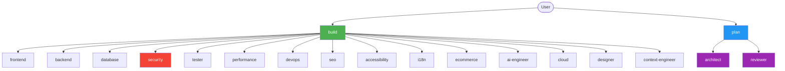
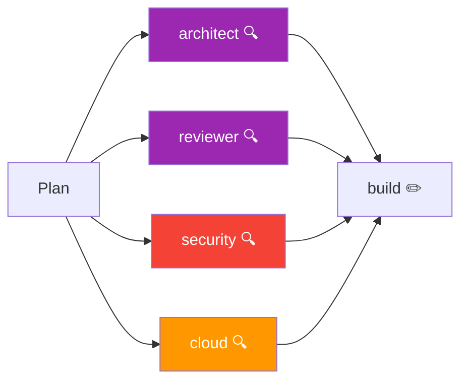
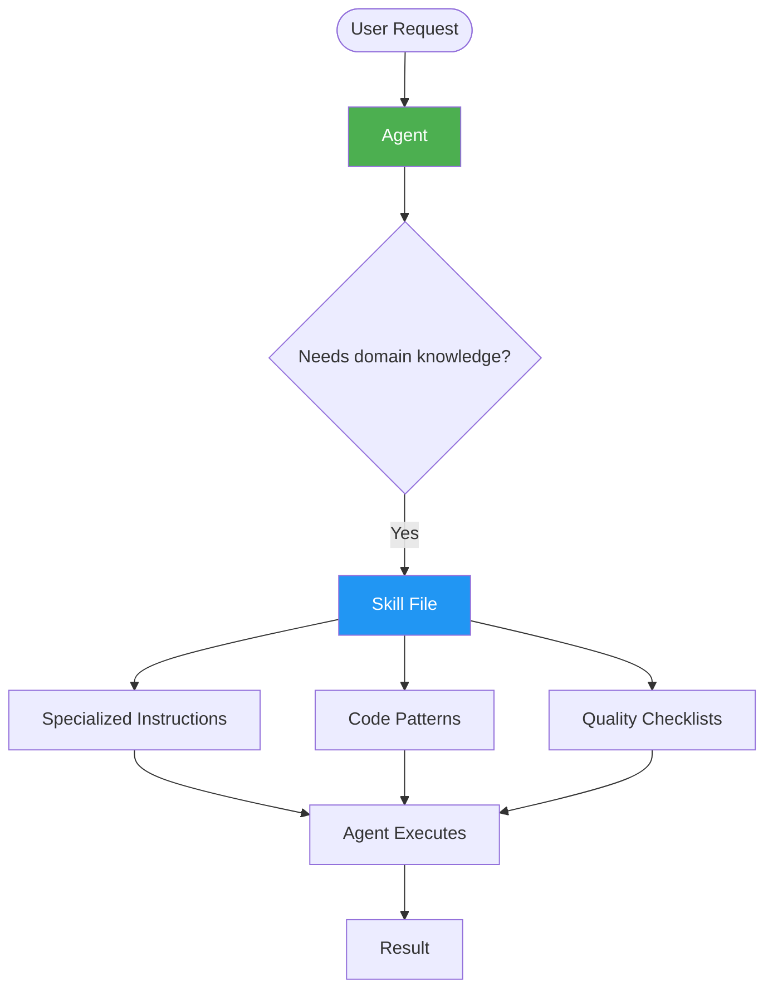

# Agents

The workspace uses **21 agents** — purpose-built AI personas that handle specific engineering domains. Each agent has defined responsibilities, tool access, and skill dependencies.

## Overview

| Metric | Count |
|--------|-------|
| Primary agents | 2 |
| Domain subagents | 19 |
| **Total agents** | **21** |
| Read-only agents | 4 |

## Agent Categories

### Primary Agents

The entry points for all user interactions. Every task starts with one of these agents.

| Agent | Role | Description |
|-------|------|-------------|
| **build** | Default | Full tool access. Executes all engineering tasks — building, editing, fixing, creating. |
| **plan** | Analysis | Read-only analysis and planning. Produces strategies without modifying files. |

### Frontend Agents

| Agent | Role | Key Skills |
|-------|------|------------|
| **frontend** | Components & UI | react-patterns, nextjs-app-router, tailwind-css, responsive-design |
| **designer** | Design systems | css-motion-design, design-tokens, accessibility |

### Backend Agents

| Agent | Role | Key Skills |
|-------|------|------------|
| **backend** | Server logic | api-design, nextjs-route-handlers, background-jobs |
| **api-designer** | API contracts | api-design, openapi-specs, versioning |

### Database Agents

| Agent | Role | Key Skills |
|-------|------|------------|
| **database** | Schema & queries | database-design, supabase-patterns, prisma-patterns |

### Security Agents

| Agent | Role | Key Skills |
|-------|------|------------|
| **security** | Vulnerability assessment | security-audit, authentication-patterns, environment-secrets |

### Quality Agents

| Agent | Role | Key Skills |
|-------|------|------------|
| **reviewer** | Code review | code-review-standards, refactoring-patterns |
| **tester** | Test creation | test-strategy, testing-patterns, coverage-analysis |
| **accessibility** | A11y audit | wcag-checklist, keyboard-navigation, screen-reader-patterns |
| **performance** | Optimization | web-performance, caching-strategies, image-optimization, bundle-optimization |

### Architecture Agents

| Agent | Role | Key Skills |
|-------|------|------------|
| **architect** | System design | architecture-patterns, refactoring-strategy, technical-debt |

### DevOps Agents

| Agent | Role | Key Skills |
|-------|------|------------|
| **devops** | CI/CD & builds | ci-cd-pipelines, vercel-deployment, docker-patterns |
| **cloud** | Cloud architecture | serverless-patterns, cost-optimization, cloud-security |

### AI Agents

| Agent | Role | Key Skills |
|-------|------|------------|
| **ai-engineer** | LLM integration | llm-integration, rag-patterns, prompt-engineering |
| **context-engineer** | Workspace optimization | workspace-optimization, context-management |

### Design Agents

| Agent | Role | Key Skills |
|-------|------|------------|
| **designer** | Design systems | design-tokens, css-motion-design |

### i18n Agents

| Agent | Role | Key Skills |
|-------|------|------------|
| **i18n** | Translations & RTL | i18n-architecture, rtl-engineering |

### E-Commerce Agents

| Agent | Role | Key Skills |
|-------|------|------------|
| **ecommerce** | Product & checkout | product-catalogs, checkout-flows, payment-integration |

### SEO Agents

| Agent | Role | Key Skills |
|-------|------|------------|
| **seo** | Search optimization | technical-seo, nextjs-seo, structured-data |

## Read-Only Agents

Four agents operate in **read-only mode** — they analyze and advise but never modify files directly. Their output is presented to the user or passed to a build agent for execution.

| Agent | Read-Only Scope | Why Read-Only |
|-------|----------------|---------------|
| **architect** | All modifications | Architecture decisions require human approval before implementation |
| **reviewer** | All modifications | Code review is advisory; authors make their own changes |
| **security** | All modifications | Security findings are reported, not silently fixed |
| **cloud** | All modifications | Cloud changes have infrastructure impact requiring explicit approval |

## Routing Rules

Agents are selected based on file paths and keyword detection.

### Path-Based Routing

| File Path Pattern | Primary Agent | Secondary Agents |
|-------------------|---------------|------------------|
| `src/components/`, `*.tsx` with JSX | frontend | designer, accessibility |
| `src/app/api/`, `route.ts` | backend | api-designer, security |
| `src/app/` pages | frontend | seo, i18n |
| Schema/migration files | database | architect |
| `.github/workflows/` | devops | security |
| `src/app/admin/` | frontend | backend, security |
| Translation files, `t()` calls | i18n | frontend |
| `*.test.*`, `*.spec.*` | tester | reviewer |
| Auth/token/security files | security | backend |
| Meta tags, `generateMetadata` | seo | frontend |
| ARIA, role attributes | accessibility | frontend |

### Keyword-Based Routing

| Keywords | Agent |
|----------|-------|
| component, render, props, state, hook, CSS | frontend |
| API, endpoint, route, request, middleware | backend |
| database, schema, table, query, migration | database |
| deploy, build, CI, pipeline, Docker | devops |
| security, auth, token, permission | security |
| test, coverage, mock, assert, spec | tester |
| performance, bundle, lazy, cache, optimize | performance |
| accessibility, a11y, WCAG, ARIA | accessibility |
| SEO, meta, sitemap, ranking | seo |
| translate, i18n, RTL, Arabic, locale | i18n |
| payment, Stripe, checkout, cart | ecommerce |
| architecture, pattern, refactor, scale | architect |
| LLM, AI, prompt, embedding, vector | ai-engineer |

### Priority Hierarchy

1. **Security findings** — always addressed first
2. **Build-breaking issues** — fixed before feature work
3. **User explicit request** — highest intent priority
4. **Primary agent domain detection** — automatic routing
5. **Skill-triggered loading** — on-demand context
6. **Quality recommendations** — advisory
7. **Performance suggestions** — advisory

### Conflict Resolution

- Security overrides all other domains when there's a conflict
- Accessibility wins over SEO when they conflict
- Multiple agent suggestions → primary agent presents both to user
- Skill overlap → load both; they complement rather than conflict

## How Agents Work with Skills

Agents delegate domain knowledge to **skills** — focused instruction files that provide specialized workflows, code patterns, and checklists.

**Agent → Skill mapping:**

| Agent | Primary Skills |
|-------|---------------|
| build | (all skills, default entry point) |
| plan | reviewer, architect, security |
| frontend | react-patterns, nextjs-app-router, tailwind-css, responsive-design, form-engineering |
| backend | api-design, nextjs-route-handlers, background-jobs |
| database | database-design, supabase-patterns, prisma-patterns |
| security | security-audit, authentication-patterns, environment-secrets |
| reviewer | code-review-standards, refactoring-patterns |
| performance | web-performance, caching-strategies, image-optimization, bundle-optimization |
| accessibility | wcag-checklist, keyboard-navigation, screen-reader-patterns |
| seo | technical-seo, nextjs-seo |
| i18n | i18n-architecture, rtl-engineering |
| devops | ci-cd-pipelines, vercel-deployment, docker-patterns |
| architect | (reads all skills for context, no direct dependencies) |

## Configuration

Agent definitions live in `~/.config/opencode/agents/` (global) or `.opencode/agents/` (project-specific). Each agent file specifies:

- **Name and description**
- **Tool permissions** (read, write, bash, search)
- **Skill dependencies**
- **Routing triggers** (file patterns, keywords)
- **Read-only flag** (for advisory agents)

See the `customize-opencode` skill for agent creation workflows.
