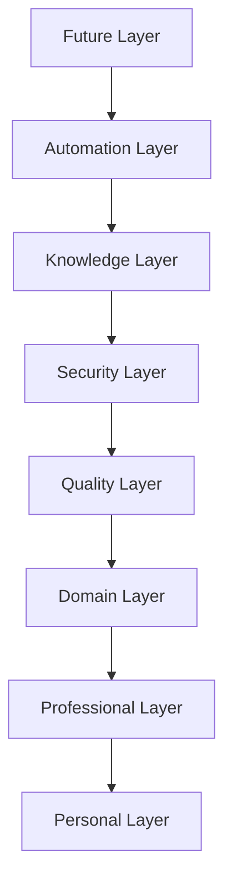
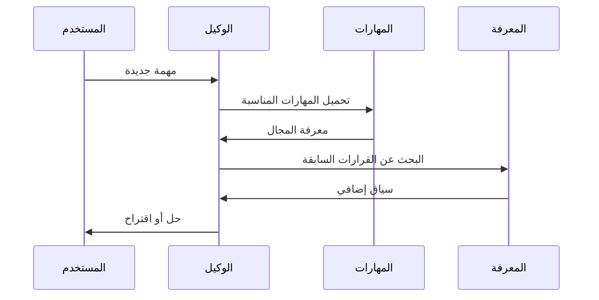

# الهيكلة العامة

## نموذج الطبقات الثمانية

بُنيت مساحة العمل على نموذج طبقات ثمانية مصمم للهندسة المؤسسية:



| الطبقة | النطاق | المكونات |
|--------|--------|----------|
| **المستقبل** | التجريبية | نظام الإضافات، الميزات التجريبية |
| **الأتمتة** | سير العمل | الأوامر، القوالب، المولّدات |
| **المعرفة** | التعلم | الذاكرة، القرارات، الدروس المستفادة |
| **الأمان** | الحماية | المصادقة، التوقيعات، الامتثال |
| **الجودة** | المراجعة | الاختبارات، المراجعة، التوافقيات |
| **المجال** | التخصص | المهارات، خبرات الوكلاء |
| **المهني** | المعايير | معايير الهندسة الشاملة |
| **الشخصي** | التفضيلات | تفضيلات أحمد وأسلوبه |

## منظومة الوكلاء

### وكيل بناء الواجهة الأمامية (`frontend`)
- متخصص في React وNext.js وTailwind CSS
- يفهم أنماط المكونات والتجربة المستخدم
- ينتج كود TypeScript صارم

### وكيل الأمان (`security`)
- يراجع الكود بحثًا عن الثغرات
- يتحقق من المصادقة والتفويض
- يطبق معايير OWASP Top 10

### وكيل قواعد البيانات (`database`)
- يصمم المخططات والترانزاكشنز
- يحسن الاستعلامات
- يدير الترحيل

## منظومة المهارات

المهارات وحدات معرفية مستقلة تُحمّل حسب الطلب:

```
react-patterns ←→ nextjs-app-router (متكاملة)
tailwind-css ←→ responsive-design (متكاملة)
security-audit ←→ authentication-patterns ←→ secrets-management (عنقود أمان)
```

## تدفق سير العمل النموذجي



::: info
انظر [الهيكل المجلدي](/ar/folder-structure) لمعرفة مكان كل ملف.
:::
