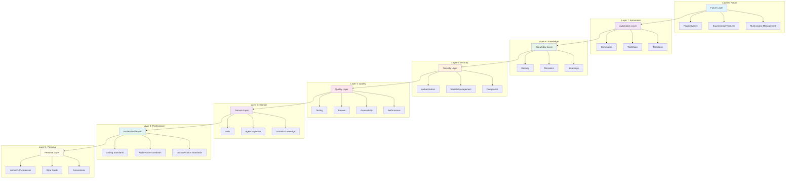
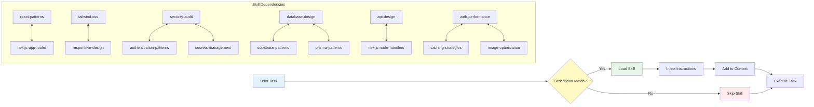
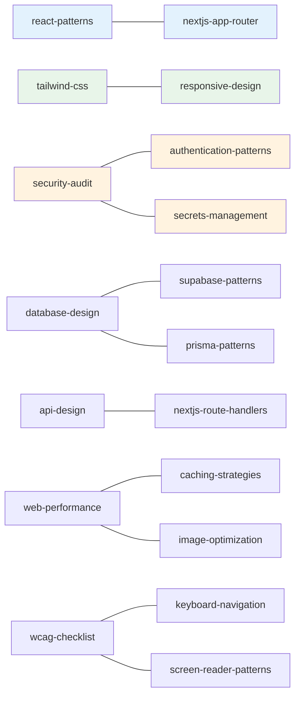
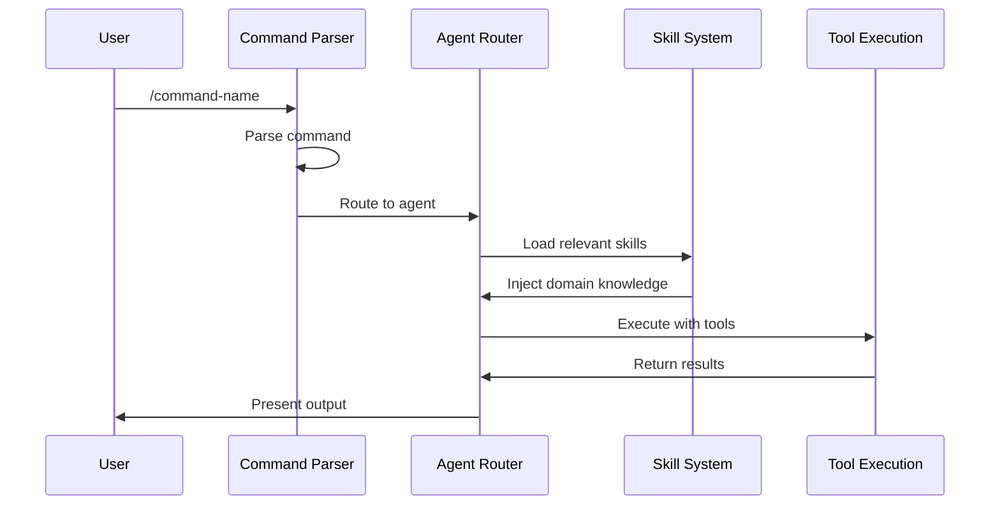
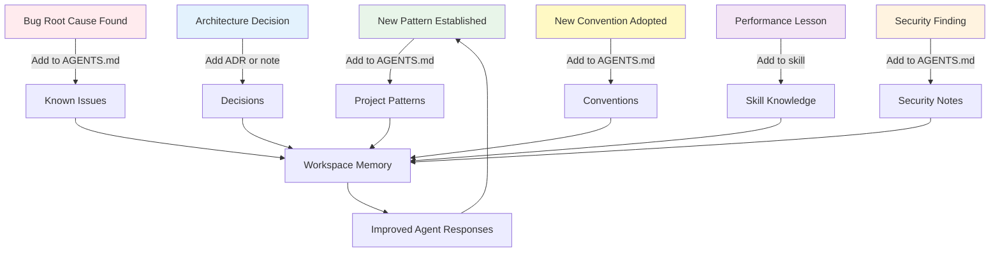
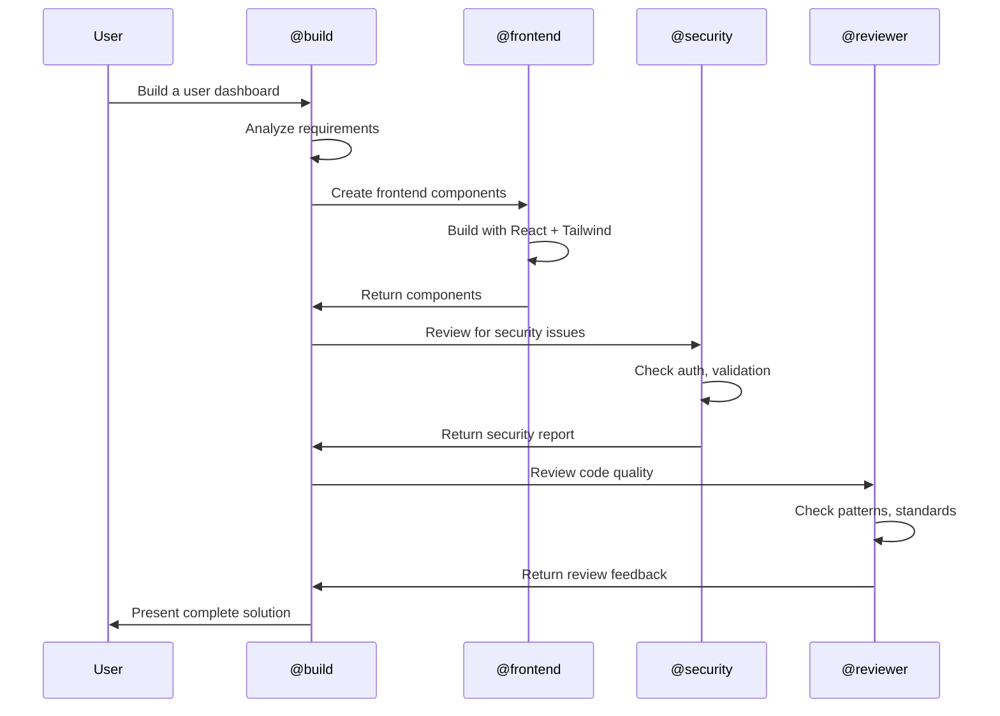

# Architecture Overview

The Ahmed Enterprise AI Workspace is built on an **8-Layer Architecture** designed for enterprise-grade AI engineering. This document explains how each layer works and how components interact.

## 8-Layer Workspace Model



### Layer Descriptions

| Layer | Scope | Mutability | Description |
|-------|-------|------------|-------------|
| **Personal** | Ahmed's preferences | User edits | Style, conventions, RTL-first, bilingual |
| **Professional** | Universal standards | Rarely changes | Coding, architecture, security, quality standards |
| **Domain** | Engineering knowledge | Grows over time | Skills, agent expertise, domain-specific patterns |
| **Quality** | Testing & review | Evolves | Testing, code review, accessibility, performance |
| **Security** | Auth & compliance | Stable | Authentication, secrets, OWASP, audit |
| **Automation** | Workflows | Added as needed | Commands, workflows, templates |
| **Knowledge** | Memory & decisions | Accumulates | ADRs, patterns, lessons, learnings |
| **Future** | Expansion | Experimental | Plugin system, multi-project, advanced features |

---

## Agent System

### Agent Overview

The workspace includes **22 specialized agents** across all engineering domains.

```mermaid
flowchart TD
    User[User Input] --> Router[Domain Router]
    
    Router -->|file: src/components/*| FE[Frontend Agent]
    Router -->|file: src/app/api/*| BE[Backend Agent]
    Router -->|file: schema/*| DB[Database Agent]
    Router -->|file: .github/*| DO[DevOps Agent]
    Router -->|keyword: component, render| FE
    Router -->|keyword: API, endpoint| BE
    Router -->|keyword: schema, migration| DB
    Router -->|keyword: deploy, CI| DO
    Router -->|keyword: security, auth| SEC[Security Agent]
    Router -->|keyword: test, coverage| TEST[Tester Agent]
    Router -->|keyword: performance| PERF[Performance Agent]
    Router -->|keyword: a11y, WCAG| A11Y[Accessibility Agent]
    
    User -->|@agent-name| Direct[Direct Agent Access]
    
    FE --> Skills[Skill System]
    BE --> Skills
    DB --> Skills
    DO --> Skills
    SEC --> Skills
    TEST --> Skills
    PERF --> Skills
    A11Y --> Skills
    
    Skills --> Output[Agent Response]
    Direct --> Output

    style User fill:#e3f2fd
    style Router fill:#fff9c4
    style Skills fill:#e8f5e9
    style Output fill:#f3e5f5
```

### Primary Agents

| Agent | Domain | Access |
|-------|--------|--------|
| `@build` | Default, full tool access | All tools |
| `@plan` | Analysis and planning | Read-only |

### Domain Agents

| Agent | Domain | Primary Use |
|-------|--------|-------------|
| `@frontend` | React, Tailwind, client-side | Component creation, styling |
| `@backend` | API routes, server logic | Route handlers, middleware |
| `@database` | Schema, queries, migrations | Database design, optimization |
| `@api-designer` | API contracts, REST design | API versioning, documentation |
| `@architect` | System design, patterns | Refactoring, technical debt |
| `@reviewer` | Code quality review | Pattern consistency |
| `@security` | Vulnerability assessment | Auth review, secrets detection |
| `@tester` | Test creation, strategy | Coverage analysis |
| `@accessibility` | WCAG audit, ARIA review | Keyboard navigation |
| `@performance` | Bundle analysis, caching | Core Web Vitals |
| `@devops` | CI/CD, build automation | Deployment |
| `@cloud` | Cloud architecture | Serverless patterns |
| `@seo` | Meta tags, structured data | Sitemap, Open Graph |
| `@i18n` | Translation management | RTL validation |
| `@ecommerce` | Product catalogs, carts | Checkout, pricing |
| `@ai-engineer` | LLM integration, RAG | Prompt optimization |
| `@context-engineer` | Workspace optimization | AGENTS.md maintenance |
| `@designer` | Design systems, tokens | Typography, motion |

### Routing Rules

**File-based routing:**

| File Path Pattern | Agent |
|-------------------|-------|
| `src/components/`, `*.tsx` with JSX | Frontend |
| `src/app/api/`, `route.ts` | Backend + API Designer |
| `src/app/` pages | Frontend |
| Schema/migration files | Database |
| `.github/workflows/` | DevOps |
| `src/app/admin/` | Frontend + Backend |
| Translation files, `t()` calls | i18n |
| `*.test.*`, `*.spec.*` | Tester |
| Auth/token/security files | Security |
| Meta tags, `generateMetadata` | SEO |
| ARIA, role attributes | Accessibility |

**Priority hierarchy:**
1. Security findings → always addressed first
2. Build-breaking issues → fixed before feature work
3. User explicit request → highest intent priority
4. Primary agent domain detection → automatic routing
5. Skill-triggered loading → on-demand context
6. Quality recommendations → advisory
7. Performance suggestions → advisory

---

## Skill System

### How Skills Work

Skills are on-demand knowledge modules loaded when tasks match their descriptions.



### Skill Categories

| Category | Skills | Description |
|----------|--------|-------------|
| **Frontend** | react-patterns, nextjs-app-router, tailwind-css, responsive-design, form-engineering, state-management, css-motion-design | React and UI development |
| **Backend** | api-design, nextjs-route-handlers, background-jobs | Server-side development |
| **Database** | database-design, supabase-patterns, prisma-patterns | Data layer |
| **Security** | security-audit, authentication-patterns, environment-secrets, jwt-security | Security practices |
| **Performance** | web-performance, caching-strategies, image-optimization, bundle-optimization | Speed optimization |
| **Quality** | code-review-standards, refactoring-patterns, debug | Code quality |
| **Testing** | (tester agent handles) | Test strategy |
| **Accessibility** | wcag-checklist, keyboard-navigation, screen-reader-patterns | A11y compliance |
| **SEO** | technical-seo, nextjs-seo | Search optimization |
| **i18n** | i18n-architecture, rtl-engineering | Internationalization |
| **DevOps** | ci-cd-pipelines, vercel-deployment, docker-patterns | Deployment |
| **Architecture** | (architect agent reads all) | System design |
| **AI** | llm-integration, rag-patterns, prompt-engineering | AI development |
| **Workspace** | workspace-optimization | Self-improvement |

### Skill Cross-References

Skills reference each other for complementary knowledge:



---

## Command System

### Command Execution Flow



### Command Categories

| Category | Commands | Description |
|----------|----------|-------------|
| **Review** | `/review`, `/security-scan`, `/performance-check`, `/a11y-audit`, `/seo-check` | Code analysis |
| **Generation** | `/new-page`, `/new-api`, `/new-component` | Create new files |
| **Refactoring** | `/refactor` | Improve existing code |
| **Deployment** | `/deploy-check` | Deployment readiness |
| **Documentation** | `/generate-docs` | Create documentation |
| **Workspace** | `/health-check`, `/workspace-audit`, `/workspace-validate`, `/self-improve` | Workspace management |
| **Creation** | `/create-skill`, `/create-agent`, `/create-command`, `/create-playbook` | Extend the workspace |

---

## Knowledge Accumulation

### How Knowledge Grows

The workspace accumulates knowledge over time through decisions, patterns, and learnings.



### Anti-Patterns (Never Store)

- Credentials or secrets
- Temporary workarounds (mark as `[TEMP]` and remove later)
- Duplicate information across layers
- Information that belongs in code
- Speculative future requirements

---

## Dependency Graph

The full dependency graph shows how agents, skills, and commands relate:

```mermaid
graph TB
    subgraph "Agents"
        BUILD[build]
        PLAN[plan]
        FE[frontend]
        BE[backend]
        DB[database]
        SEC[security]
        REV[reviewer]
        TEST[tester]
        PERF[performance]
        A11Y[accessibility]
        DO[devops]
        SEO[seo]
        I18N[i18n]
        ARCH[architect]
    end

    subgraph "Skills"
        RP[react-patterns]
        NA[nextjs-app-router]
        TC[tailwind-css]
        RD[responsive-design]
        AD[api-design]
        DD[database-design]
        SA[security-audit]
        CR[code-review-standards]
        WP[web-performance]
        WC[wcag-checklist]
        TSEO[technical-seo]
        II[i18n-architecture]
        CICD[ci-cd-pipelines]
    end

    subgraph "Commands"
        REVIEW[/review]
        SSCAN[/security-scan]
        PCHECK[/performance-check]
        A11YAUDIT[/a11y-audit]
        SEOCHK[/seo-check]
        NPAGE[/new-page]
        NAPI[/new-api]
        NCOMP[/new-component]
        REFACTOR[/refactor]
        DCHK[/deploy-check]
    end

    BUILD --> RP
    BUILD --> NA
    BUILD --> TC
    PLAN --> REV
    PLAN --> ARCH
    PLAN --> SEC
    FE --> RP
    FE --> NA
    FE --> TC
    FE --> RD
    BE --> AD
    DB --> DD
    SEC --> SA
    REV --> CR
    PERF --> WP
    A11Y --> WC
    SEO --> TSEO
    I18N --> II
    DO --> CICD

    REVIEW --> REV
    SSCAN --> SEC
    PCHECK --> PERF
    A11YAUDIT --> A11Y
    SEOCHK --> SEO
    NPAGE --> FE
    NAPI --> BE
    NCOMP --> FE
    REFACTOR --> ARCH
    DCHK --> DO

    style BUILD fill:#e3f2fd
    style FE fill:#e8f5e9
    style BE fill:#fff3e0
    style DB fill:#f3e5f5
    style SEC fill:#ffebee
```

---

## Configuration System

### Global Configuration

Located at `~/.config/opencode/`:

```
~/.config/opencode/
├── agents/           # 22 global agents
├── skills/           # 67 global skills
├── commands/         # 17 global commands
├── knowledge/        # 35 knowledge documents
├── examples/         # 36 code examples
├── playbooks/        # 16 engineering playbooks
├── generators/       # 6 workspace generators
├── workspace-memory/ # Accumulated knowledge
├── metrics/          # Workspace metrics
└── AGENTS.md         # Root configuration
```

### Project Configuration

Located at `.opencode/` in your project root:

```
your-project/
├── .opencode/
│   ├── agents/       # Project-specific agents
│   ├── skills/       # Project-specific skills (14)
│   ├── commands/     # Project-specific commands (5)
│   └── AGENTS.md     # Project instructions
```

### Configuration Priority

Project-level configuration overrides global configuration:

1. `.opencode/` (project) — highest priority
2. `~/.config/opencode/` (global) — default
3. Built-in defaults — fallback

---

## Multi-Agent Collaboration

### How Agents Work Together



### Conflict Resolution

When multiple agents have opinions:

1. **Security overrides all** — security findings always win
2. **Build-breaking first** — fix before features
3. **User intent priority** — explicit request > auto-detection
4. **Agent presentation** — primary agent presents options to user

---

## Next Steps

- [Workspace Overview](/workspace-overview) — What's inside each component
- [Folder Structure](/folder-structure) — Complete file layout
- [Glossary](/glossary) — All terms defined
