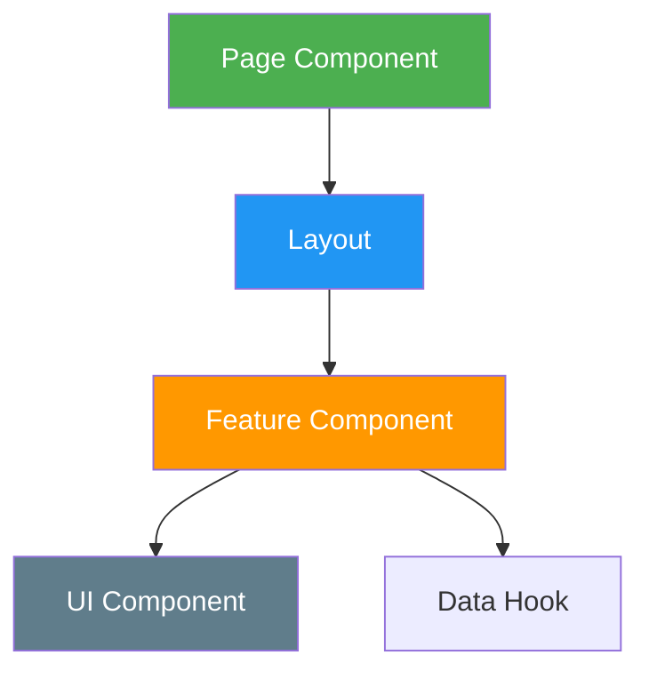
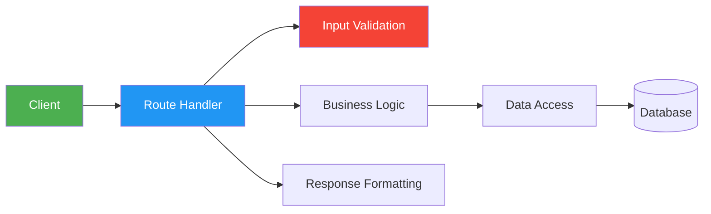

# Best Practices

The workspace enforces consistent engineering standards across all projects. These practices are encoded in skills, enforced by agents, and demonstrated in examples.

## Coding Standards

### TypeScript

```typescript
// ✅ Good: Explicit types, no any
function calculateTotal(items: CartItem[]): number {
  return items.reduce((sum, item) => sum + item.price * item.quantity, 0);
}

// ❌ Bad: Implicit any, unclear naming
function calc(a: any) {
  return a.reduce((s, i) => s + i.p * i.q, 0);
}
```

| Standard | Rule |
|----------|------|
| Strict mode | Always `"strict": true` in `tsconfig.json` |
| No `any` | Use `unknown` and narrow with type guards |
| Explicit return types | Functions must declare return types |
| Interfaces over types | Prefer `interface` for object shapes |
| Naming | camelCase variables/functions, PascalCase types |

### React Components

```typescript
// ✅ Good: Functional component with typed props
interface ButtonProps {
  variant: 'primary' | 'secondary';
  children: React.ReactNode;
  onClick?: () => void;
}

export function Button({ variant, children, onClick }: ButtonProps) {
  return (
    <button className={`btn btn-${variant}`} onClick={onClick}>
      {children}
    </button>
  );
}
```

| Standard | Rule |
|----------|------|
| Functional components | No class components |
| Named exports | `export function ComponentName` |
| Props interfaces | Define props with TypeScript interface |
| One component per file | File name matches component name |
| Max 300 lines | Split larger components |

### File Organization

```
src/
├── app/              # Next.js App Router pages
│   ├── api/          # API routes
│   ├── (routes)/     # Route groups
│   └── layout.tsx    # Root layout
├── components/       # Shared components (flat)
├── lib/              # Utilities, contexts, clients
│   ├── contexts/     # React contexts
│   ├── hooks/        # Custom hooks
│   └── utils/        # Utility functions
└── types/            # Shared TypeScript types
```

## Architecture Patterns

### Component Architecture



| Pattern | When to Use |
|---------|-------------|
| **Container/Presentational** | Separate data fetching from rendering |
| **Composition** | Build complex UIs from simple pieces |
| **Custom Hooks** | Extract reusable stateful logic |
| **Context Providers** | Share state across component tree |
| **Render Props** | Flexible component customization |

### API Architecture



| Pattern | When to Use |
|---------|-------------|
| **REST** | Standard CRUD operations |
| **Route Handlers** | Next.js API routes |
| **Middleware** | Cross-cutting concerns (auth, logging) |
| **Error Boundaries** | Catch and display errors gracefully |

### Database Patterns

| Pattern | When to Use |
|---------|-------------|
| **RLS Policies** | Row-level security in Supabase |
| **Migrations** | Schema changes with rollback |
| **Indexes** | Optimize frequent queries |
| **Connection Pooling** | Manage database connections |

## Performance Guidelines

### Core Web Vitals

| Metric | Target | Measurement |
|--------|--------|-------------|
| **LCP** | < 2.5s | Largest Contentful Paint |
| **FID** | < 100ms | First Input Delay |
| **CLS** | < 0.1 | Cumulative Layout Shift |
| **INP** | < 200ms | Interaction to Next Paint |

### Optimization Checklist

- [ ] Images optimized (WebP, responsive sizes, lazy loading)
- [ ] Code splitting implemented (dynamic imports)
- [ ] Fonts optimized (subset, preload, display=swap)
- [ ] CSS critical path inlined
- [ ] JavaScript bundle analyzed and tree-shaken
- [ ] API responses cached where appropriate
- [ ] Database queries optimized (no N+1)

### Performance Patterns

```typescript
// ✅ Good: Lazy loading
const HeavyComponent = dynamic(() => import('./HeavyComponent'), {
  loading: () => <Skeleton />,
});

// ❌ Bad: Eager loading
import HeavyComponent from './HeavyComponent';
```

```typescript
// ✅ Good: Image optimization
import Image from 'next/image';
<Image src="/photo.webp" width={800} height={600} loading="lazy" />

// ❌ Bad: Raw img tag

```

## Security Practices

See [Security](/security/) for the full security baseline.

### Quick Reference

| Practice | Rule |
|----------|------|
| Secrets | Environment variables only, never committed |
| Input validation | Validate all external input at boundaries |
| Authentication | httpOnly cookies, short-lived JWTs |
| Authorization | RLS policies, role checks on all routes |
| Error handling | Never expose stack traces in production |
| Dependencies | Audit regularly, no known vulnerabilities |

## Documentation Standards

### README Structure

Every project must have a README.md with:

1. **Project name and description**
2. **Tech stack**
3. **Installation instructions**
4. **Environment variables**
5. **Development commands**
6. **Deployment instructions**
7. **License**

### Code Documentation

| Rule | Example |
|------|---------|
| Explain why, not what | `// Retry 3x because API is flaky` |
| Document non-obvious logic | Complex business rules |
| Keep comments current | Remove outdated comments |
| Use JSDoc for public APIs | Function and class documentation |

### API Documentation

Every API endpoint must document:
- Method and path
- Request body/params
- Response format
- Error codes
- Authentication requirements

## Quality Standards

### Testing Strategy

| Test Type | Coverage Target | Tool |
|-----------|----------------|------|
| Unit tests | Business logic | Jest/Vitest |
| Integration tests | API endpoints | Jest + Supertest |
| E2E tests | Critical user flows | Playwright |
| Component tests | Complex UI | React Testing Library |

### Code Review Checklist

- [ ] Types correct (no `any`)
- [ ] Error handling present
- [ ] Input validation included
- [ ] Tests written for new logic
- [ ] Documentation updated
- [ ] No hardcoded values
- [ ] Security implications considered
- [ ] Performance impact assessed

## i18n Standards

| Rule | Implementation |
|------|----------------|
| Bilingual | Arabic primary, English secondary |
| RTL-first | All layouts support `dir="rtl"` |
| Translation keys | Dot-separated: `section.element` |
| Font stack | Cairo (body), Tajawal (display) |
| Language switching | Client-side via React Context |

## Consistent Naming

| Element | Convention | Example |
|---------|-----------|---------|
| Variables/functions | camelCase | `userName`, `handleSubmit` |
| Components | PascalCase | `UserProfile`, `NavBar` |
| Files | camelCase (ts), PascalCase (tsx) | `utils.ts`, `Button.tsx` |
| Folders | kebab-case | `user-profile/`, `api-routes/` |
| CSS classes | Tailwind utilities | `bg-primary text-surface` |
| Environment variables | SCREAMING_SNAKE | `NEXT_PUBLIC_SUPABASE_URL` |
| Git commits | `type(scope): description` | `feat(auth): add login` |
