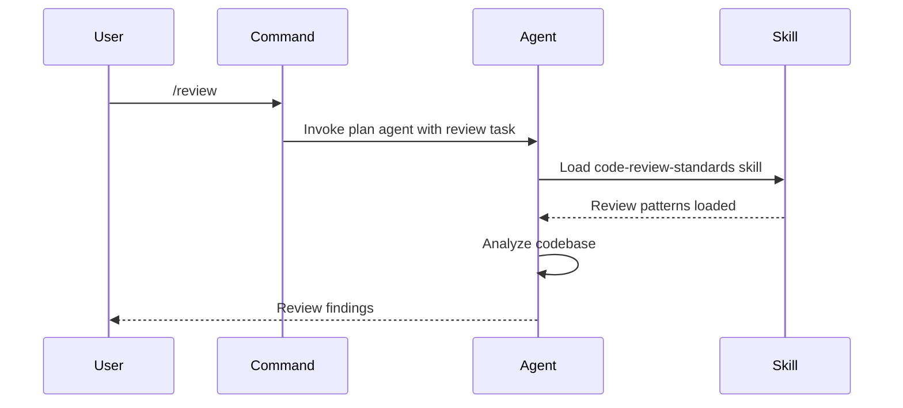

# Commands

Commands are pre-built workflows that invoke specific agents to perform common engineering tasks. They provide a quick interface for recurring operations without needing to describe the full context each time.

## Overview

| Metric | Count |
|--------|-------|
| Global commands | 17 |
| Project-specific commands | 5 |
| **Total** | **22** |

## Command Categories

### Audit Commands (5)

Commands that analyze codebases for quality, security, and compliance.

| Command | Agent | Description |
|---------|-------|-------------|
| `/review` | plan | Full code review with actionable feedback |
| `/security-scan` | security | Vulnerability assessment and OWASP coverage check |
| `/performance-check` | performance | Core Web Vitals, bundle analysis, optimization opportunities |
| `/a11y-audit` | accessibility | WCAG 2.1 AA compliance audit |
| `/seo-check` | seo | Meta tags, structured data, sitemap validation |

### Creation Commands (3)

Commands that scaffold new project components.

| Command | Agent | Description |
|---------|-------|-------------|
| `/new-page` | frontend | Create a new page with layouts and routing |
| `/new-api` | backend | Create a new API endpoint with validation |
| `/new-component` | frontend | Create a new React component with props |

### Analysis Commands (2)

Commands that analyze code for specific concerns.

| Command | Agent | Description |
|---------|-------|-------------|
| `/refactor` | architect | Analyze and plan refactoring with risk assessment |
| `/deploy-check` | devops | Pre-deployment validation and configuration check |

### Documentation Commands (1)

| Command | Agent | Description |
|---------|-------|-------------|
| `/generate-docs` | current agent | Generate documentation for components, APIs, or modules |

### Workspace Commands (6)

Commands that manage the workspace itself.

| Command | Agent | Description |
|---------|-------|-------------|
| `/create-skill` | current agent | Create a new skill with templates and validation |
| `/create-agent` | current agent | Create a new agent with configuration |
| `/create-command` | current agent | Create a new command with delegation rules |
| `/self-improve` | current agent | Analyze workspace health and auto-fix issues |
| `/workspace-audit` | current agent | Validate workspace structure and manifests |
| `/workspace-validate` | current agent | Cross-check manifests against actual files |

## How to Invoke Commands

Commands are invoked with a forward slash in the TUI:

```
/command-name
```

Some commands accept arguments:

```
/new-page about
/new-api users/profile
/new-component Button
```

## Command → Agent Delegation

Each command delegates to a specific agent. The command defines the task template, and the agent executes with full tool access.

```mermaid
graph LR
    User[/review] --> Plan[plan agent]
    User[/security-scan] --> Security[security agent]
    User[/performance-check] --> Performance[performance agent]
    User[/new-page] --> Frontend[frontend agent]
    User[/new-api] --> Backend[backend agent]
    User[/new-component] --> Frontend2[frontend agent]
    User[/refactor] --> Architect[architect agent]
    User[/deploy-check] --> DevOps[devops agent]
    User[/generate-docs] --> Current[current agent]

    style Plan fill:#2196F3,color:#fff
    style Security fill:#F44336,color:#fff
    style Performance fill:#FF9800,color:#fff
    style Frontend fill:#4CAF50,color:#fff
    style Backend fill:#4CAF50,color:#fff
    style Architect fill:#9C27B0,color:#fff
    style DevOps fill:#607D8B,color:#fff
```

**Delegation flow:**



## Command Files

- **Global commands:** `~/.config/opencode/commands/`
- **Project commands:** `.opencode/commands/`

Each command file defines:

```yaml
---
name: command-name
description: What the command does
agent: target-agent
arguments:
  - name: arg1
    description: Description
    required: false
---
```

## Creating Custom Commands

Use the `/create-command` workspace command or follow the template in `commands/templates/`. A command file needs:

1. **Frontmatter** — name, description, target agent
2. **Task template** — the prompt or instructions sent to the agent
3. **Argument definitions** — optional parameters the command accepts
4. **Skill dependencies** — skills to load before execution

See [Commands Templates](/templates/) for starter templates.
