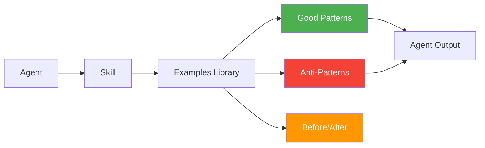

# Examples Library

The examples library contains **36 example files** across **12 categories**. Each category includes good examples (recommended patterns), bad examples (anti-patterns), and before-after comparisons (refactoring demonstrations).

## Overview

| Metric | Count |
|--------|-------|
| Total examples | 36 |
| Categories | 12 |
| Examples per category | 3 (good, bad, before-after) |

## Categories

### Components (3 examples)

| Example | Type | Description |
|---------|------|-------------|
| `components/good-button.tsx` | ✅ Good | Composable button with variants, loading states, accessibility |
| `components/bad-button.tsx` | ❌ Bad | Monolithic button with inline styles, no a11y |
| `components/before-after-card.tsx` | 🔄 Before/After | Refactored from prop drilling to context |

### API (3 examples)

| Example | Type | Description |
|---------|------|-------------|
| `api/good-endpoint.ts` | ✅ Good | Validated endpoint with error handling, types |
| `api/bad-endpoint.ts` | ❌ Bad | No validation, swallowed errors, `any` types |
| `api/before-after-users.ts` | 🔄 Before/After | Refactored from nested callbacks to async/await |

### Database (3 examples)

| Example | Type | Description |
|---------|------|-------------|
| `database/good-schema.sql` | ✅ Good | Normalized schema with indexes, RLS policies |
| `database/bad-schema.sql` | ❌ Bad | Redundant data, missing indexes, no constraints |
| `database/before-after-query.ts` | 🔄 Before/After | Optimized from N+1 to batch query |

### Folder Structure (3 examples)

| Example | Type | Description |
|---------|------|-------------|
| `folder-structure/good-flat.ts` | ✅ Good | Flat component structure, clear naming |
| `folder-structure/bad-deep.ts` | ❌ Bad | Deep nesting, unclear boundaries |
| `folder-structure/before-after.tsx` | 🔄 Before/After | Reorganized from feature-sliced to flat |

### Authentication (3 examples)

| Example | Type | Description |
|---------|------|-------------|
| `authentication/good-jwt.ts` | ✅ Good | Secure JWT with refresh, httpOnly cookies |
| `authentication/bad-jwt.ts` | ❌ Bad | JWT in localStorage, no refresh, exposed secrets |
| `authentication/before-after-auth.ts` | 🔄 Before/After | Refactored from session to JWT with proper security |

### Security (3 examples)

| Example | Type | Description |
|---------|------|-------------|
| `security/good-validation.ts` | ✅ Good | Input validation, sanitization, parameterized queries |
| `security/bad-validation.ts` | ❌ Bad | No validation, string concatenation, XSS vulnerable |
| `security/before-after-sanitize.ts` | 🔄 Before/After | Added input validation to existing endpoints |

### SEO (3 examples)

| Example | Type | Description |
|---------|------|-------------|
| `seo/good-metadata.ts` | ✅ Good | Dynamic metadata, Open Graph, structured data |
| `seo/bad-metadata.ts` | ❌ Bad | Static meta tags, no OG, missing canonical |
| `seo/before-after-metadata.ts` | 🔄 Before/After | Enhanced static metadata to dynamic generation |

### Performance (3 examples)

| Example | Type | Description |
|---------|------|-------------|
| `performance/good-lazy.tsx` | ✅ Good | Lazy loading, code splitting, image optimization |
| `performance/bad-lazy.tsx` | ❌ Bad | Everything loaded eagerly, no optimization |
| `performance/before-after-lazy.tsx` | 🔄 Before/After | Added lazy loading to existing page |

### Accessibility (3 examples)

| Example | Type | Description |
|---------|------|-------------|
| `accessibility/good-modal.tsx` | ✅ Good | Focus trap, aria labels, keyboard navigation |
| `accessibility/bad-modal.tsx` | ❌ Bad | No focus management, no aria, mouse-only |
| `accessibility/before-after-modal.tsx` | 🔄 Before/After | Added a11y to existing modal |

### AI Workflows (3 examples)

| Example | Type | Description |
|---------|------|-------------|
| `ai-workflows/good-rag.ts` | ✅ Good | Chunking, embedding, retrieval with validation |
| `ai-workflows/bad-rag.ts` | ❌ Bad | No chunking strategy, no relevance threshold |
| `ai-workflows/before-after-rag.ts` | 🔄 Before/After | Improved RAG pipeline with better retrieval |

### Documentation (3 examples)

| Example | Type | Description |
|---------|------|-------------|
| `documentation/good-readme.md` | ✅ Good | Complete README with badges, install, usage |
| `documentation/bad-readme.md` | ❌ Bad | Minimal, no install instructions, no examples |
| `documentation/before-after-readme.md` | 🔄 Before/After | Expanded sparse README to comprehensive docs |

### Testing (3 examples)

| Example | Type | Description |
|---------|------|-------------|
| `testing/good-unit.test.ts` | ✅ Good | Focused tests, edge cases, clear assertions |
| `testing/bad-unit.test.ts` | ❌ Bad | Flaky tests, unclear assertions, no edge cases |
| `testing/before-after-test.ts` | 🔄 Before/After | Rewritten tests with proper isolation |

## Example File Structure

```
examples/
├── components/
│   ├── good-button.tsx
│   ├── bad-button.tsx
│   └── before-after-card.tsx
├── api/
│   ├── good-endpoint.ts
│   ├── bad-endpoint.ts
│   └── before-after-users.ts
├── database/
│   ├── good-schema.sql
│   ├── bad-schema.sql
│   └── before-after-query.ts
├── folder-structure/
│   ├── good-flat.ts
│   ├── bad-deep.ts
│   └── before-after.tsx
├── authentication/
│   ├── good-jwt.ts
│   ├── bad-jwt.ts
│   └── before-after-auth.ts
├── security/
│   ├── good-validation.ts
│   ├── bad-validation.ts
│   └── before-after-sanitize.ts
├── seo/
│   ├── good-metadata.ts
│   ├── bad-metadata.ts
│   └── before-after-metadata.ts
├── performance/
│   ├── good-lazy.tsx
│   ├── bad-lazy.tsx
│   └── before-after-lazy.tsx
├── accessibility/
│   ├── good-modal.tsx
│   ├── bad-modal.tsx
│   └── before-after-modal.tsx
├── ai-workflows/
│   ├── good-rag.ts
│   ├── bad-rag.ts
│   └── before-after-rag.ts
├── documentation/
│   ├── good-readme.md
│   ├── bad-readme.md
│   └── before-after-readme.md
└── testing/
    ├── good-unit.test.ts
    ├── bad-unit.test.ts
    └── before-after-test.ts
```

## How Examples Are Used

Examples serve as **reference material** for agents and skills:



- **Good examples** are referenced when agents generate code
- **Bad examples** are used to identify and fix anti-patterns during reviews
- **Before-after examples** demonstrate refactoring patterns
- Skills reference examples for concrete pattern demonstrations

## Adding Examples

To add a new example:

1. Create the file in the appropriate category directory
2. Follow the naming convention: `{type}-{description}.{ext}`
3. Add comments explaining what makes it good/bad
4. Update this index page with the new entry

**Type prefixes:**
- `good-` — recommended pattern
- `bad-` — anti-pattern to avoid
- `before-after-` — refactoring demonstration (single file showing both states)
