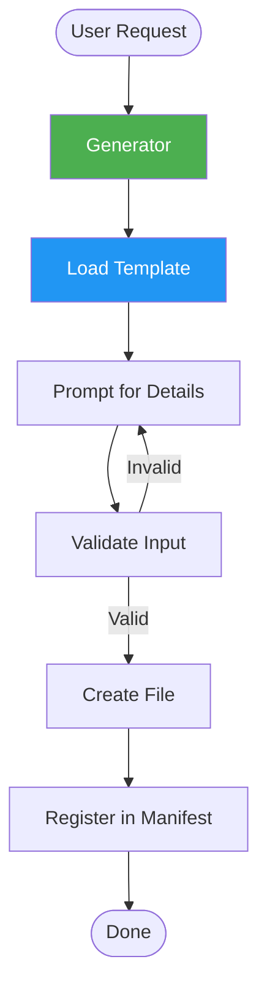
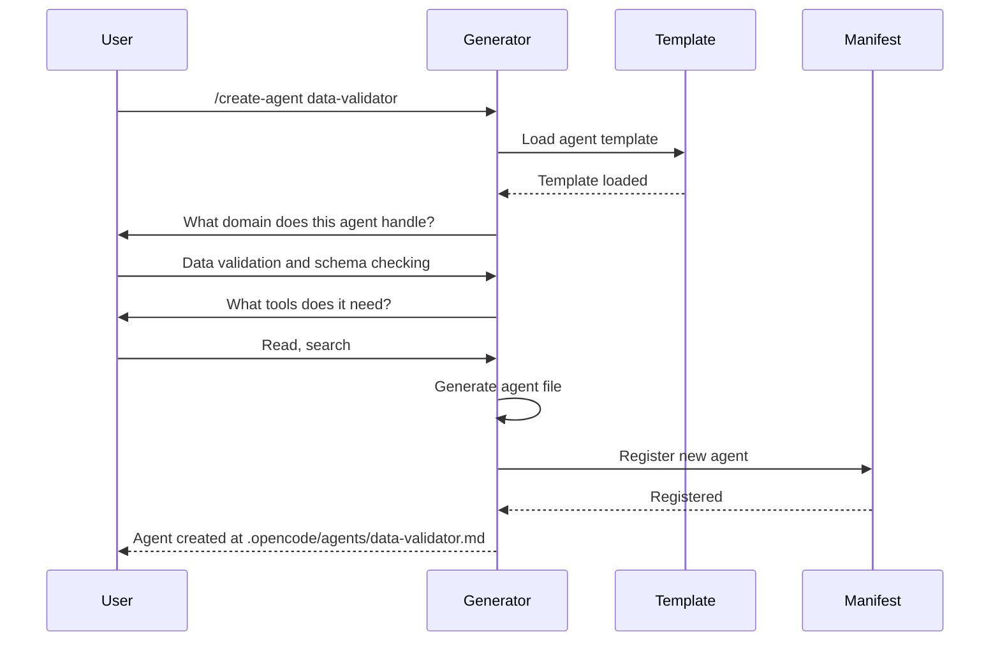

# Generators

Generators are templates and workflows for creating new workspace components — agents, skills, commands, playbooks, documentation, and project scaffolds.

## Overview

| Metric | Count |
|--------|-------|
| Total generators | 6 |
| Component generators | 3 |
| Workflow generators | 2 |
| Project generators | 1 |

## Available Generators

### Component Generators

| Generator | Creates | Output Location |
|-----------|---------|-----------------|
| **Agent Generator** | New agent definition | `~/.config/opencode/agents/` or `.opencode/agents/` |
| **Skill Generator** | New skill file | `~/.config/opencode/skills/` or `.opencode/skills/` |
| **Command Generator** | New command file | `~/.config/opencode/commands/` or `.opencode/commands/` |

### Workflow Generators

| Generator | Creates | Output |
|-----------|---------|--------|
| **Playbook Generator** | New playbook definition | `playbooks/` |
| **Documentation Generator** | API docs, component docs, README | Project documentation |

### Project Generators

| Generator | Creates | Output |
|-----------|---------|--------|
| **Project Scaffold** | New Next.js project | Entire project structure |

## How to Use Generators

Generators are invoked through workspace commands:

```
/create-agent agent-name
/create-skill skill-name
/create-command command-name
```

Or accessed through the self-improvement system:

```
/self-improve
```

## Generator Workflow



### Agent Generation Flow



## Template Structure

Each generator uses a template with placeholders:

### Agent Template

```markdown
---
name: {{name}}
description: {{description}}
tools:
  - read
  - search
  {{#if write}}
  - write
  {{/if}}
  {{#if bash}}
  - bash
  {{/if}}
read_only: {{read_only}}
skills:
  {{#each skills}}
  - {{this}}
  {{/each}}
---

# {{Name}}

## Role
{{role_description}}

## Responsibilities
{{#each responsibilities}}
- {{this}}
{{/each}}

## Constraints
{{#each constraints}}
- {{this}}
{{/each}}
```

### Skill Template

```markdown
---
name: {{name}}
description: {{description}}
category: {{category}}
---

# {{Name}}

## When to Use
{{#each triggers}}
- {{this}}
{{/each}}

## Workflow
{{#each steps}}
{{@index}}. {{this}}
{{/each}}

## Patterns
{{patterns_content}}
```

### Command Template

```markdown
---
name: {{name}}
description: {{description}}
agent: {{agent}}
arguments:
  {{#each arguments}}
  - name: {{name}}
    description: {{description}}
    required: {{required}}
  {{/each}}
---

# {{Name}}

{{description}}

## Usage
\`\`\`
/{{name}} {{#each arguments}}{{name}} {{/each}}
\`\`\`
```

## Validation

Generators validate input before creating files:

| Check | Rule |
|-------|------|
| Name format | lowercase, hyphen-separated |
| No duplicates | Checks existing files in target directory |
| Required fields | All mandatory fields must be provided |
| Agent exists | Command generator validates agent reference |
| Skill category | Must match an existing category |

## Generator Locations

| Generator | Source |
|-----------|--------|
| Agent Generator | `generators/agent-generator/` |
| Skill Generator | `generators/skill-generator/` |
| Command Generator | `generators/command-generator/` |
| Playbook Generator | `generators/playbook-generator/` |
| Documentation Generator | `generators/documentation-generator/` |
| Project Scaffold | `generators/project-scaffold/` |

## Custom Generators

To create a custom generator:

1. Create a directory in `generators/`
2. Add a `template.md` with placeholders
3. Define validation rules in `config.yaml`
4. Register in `generators/manifest.yaml`

Custom generators follow the same validation and registration flow as built-in generators.
