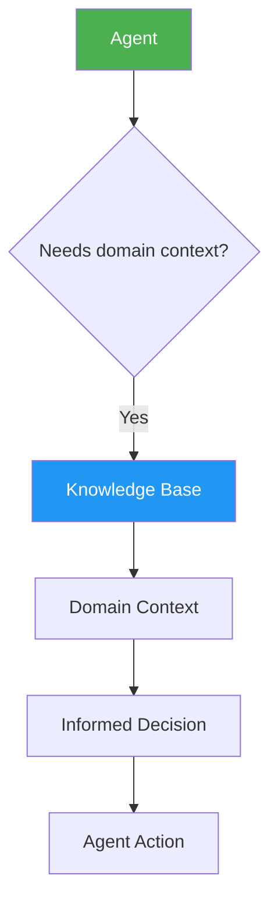

# Knowledge Base

The knowledge base contains **35 reference documents** organized by engineering domain. These documents inform agent decision-making and provide context for architecture, patterns, and conventions.

## Overview

| Metric | Count |
|--------|-------|
| Total documents | 35 |
| Frontend & Runtime | 8 |
| Backend & Infrastructure | 8 |
| Security & Architecture | 8 |
| AI & Emerging | 11 |

## Frontend & Runtime (8 documents)

| Document | Description |
|----------|-------------|
| **React Component Patterns** | Composition, render props, hooks patterns, performance |
| **Next.js App Router Guide** | File-based routing, layouts, server components, data fetching |
| **Tailwind CSS Conventions** | Utility classes, design tokens, responsive patterns |
| **Responsive Design Principles** | Mobile-first, breakpoints, fluid layouts, testing |
| **State Management Guide** | React Context, local state, when to use external stores |
| **Form Engineering** | Validation, controlled/uncontrolled, error handling |
| **Animation Patterns** | CSS transitions, keyframes, Framer Motion, reduced motion |
| **Browser API Reference** | IntersectionObserver, ResizeObserver, Web APIs |

## Backend & Infrastructure (8 documents)

| Document | Description |
|----------|-------------|
| **API Design Principles** | REST conventions, versioning, error responses |
| **Next.js Route Handlers** | API routes, middleware, request/response patterns |
| **Database Design Guide** | Schema design, normalization, indexing |
| **Supabase Patterns** | RLS, real-time, client configuration |
| **Authentication Flows** | JWT, session, OAuth, refresh tokens |
| **Authorization Patterns** | Role-based, attribute-based, row-level security |
| **Background Jobs** | Queue processing, cron, async patterns |
| **Serverless Architecture** | Edge functions, cold starts, stateless design |

## Security & Architecture (8 documents)

| Document | Description |
|----------|-------------|
| **OWASP Top 10 Guide** | Common vulnerabilities and mitigations |
| **Security Headers Reference** | CSP, HSTS, X-Frame-Options, CORS |
| **Input Validation Patterns** | Sanitization, parameterized queries, XSS prevention |
| **Clean Architecture Guide** | Layers, dependency inversion, boundaries |
| **Design Patterns Reference** | GoF patterns, anti-patterns, composition |
| **Refactoring Strategies** | Code smells, safe refactoring, testing during refactor |
| **Technical Debt Management** | Identification, prioritization, payoff strategies |
| **Dependency Management** | Version strategy, monorepo, supply chain security |

## AI & Emerging (11 documents)

| Document | Description |
|----------|-------------|
| **LLM Integration Guide** | OpenAI, Anthropic, model selection, streaming |
| **RAG Architecture** | Document chunking, vector stores, retrieval |
| **Prompt Engineering** | Templates, few-shot, chain-of-thought |
| **Embedding Strategies** | Models, similarity search, indexing |
| **Vector Database Guide** | Pinecone, pgvector, Qdrant setup |
| **AI Evaluation** | Quality measurement, A/B testing |
| **AI Safety Patterns** | Guardrails, output validation, rate limiting |
| **AI Cost Optimization** | Token management, caching, model selection |
| **AI Error Handling** | Retry logic, fallback models, graceful degradation |
| **AI Monitoring** | Usage tracking, quality metrics, alerting |
| **AI Security** | Prompt injection, data privacy, access control |

## Knowledge Document Format

Each knowledge document follows a standard structure:

```markdown
---
title: Document Title
domain: frontend|backend|security|ai
tags: [tag1, tag2]
---

# Document Title

## Overview
Brief description of the topic.

## Principles
Core principles and guidelines.

## Patterns
### Pattern 1
Description and code examples.

### Pattern 2
Description and code examples.

## Anti-Patterns
What to avoid and why.

## References
Links to external resources.
```

## How Knowledge Is Used



Knowledge documents are:
1. **Read by agents** when encountering domain-specific tasks
2. **Referenced by skills** for detailed patterns and conventions
3. **Updated** as new patterns and decisions emerge
4. **Cross-referenced** between related documents

## Adding Knowledge

New knowledge documents can be added by:
1. Creating a `.md` file in `knowledge/` with the proper frontmatter
2. Following the standard document format
3. Adding appropriate tags for discoverability
4. Updating this index page

Knowledge documents accumulate over time through:
- Architecture Decision Records (ADRs)
- Post-incident reviews
- New pattern adoption
- Technology evaluation results
