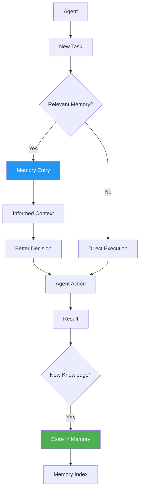

# Memory System

The memory system stores and retrieves **engineering knowledge** accumulated through project work. It captures patterns, decisions, mistakes, lessons, and preferences to inform future agent behavior.

## Overview

| Metric | Count |
|--------|-------|
| Total seed entries | 21 |
| Categories | 6 |
| Location | `workspace-memory/` |

## Memory Categories

### Patterns (5 entries)

Established engineering patterns that agents should follow.

| Entry | Description |
|-------|-------------|
| **TypeScript Strict Mode** | Always use strict mode, no `any`, explicit types |
| **Flat Component Structure** | Components in `src/components/`, no deep nesting |
| **RTL-First Design** | All layouts support Arabic with `dir="rtl"` |
| **Supabase Client Pattern** | Direct client for simple projects, Prisma for complex |
| **Tailwind Utility Classes** | Use Tailwind for all styling, no custom CSS |

### Decisions (3 entries)

Architecture and design decisions with context and rationale.

| Entry | Description |
|-------|-------------|
| **Next.js App Router** | Chosen for file-based routing, layouts, server components |
| **Supabase as Default Backend** | PostgreSQL + Auth + Storage in one service |
| **Vercel Deployment** | Zero-config deployment with preview environments |

### Mistakes (4 entries)

Common mistakes to avoid, with root causes and fixes.

| Entry | Description |
|-------|-------------|
| **Swallowed Errors** | Never catch errors silently — always log or re-throw |
| **Hardcoded Secrets** | Never commit secrets — use environment variables |
| **Missing Input Validation** | Always validate external input at boundaries |
| **N+1 Queries** | Use batch queries, not loops with individual queries |

### Lessons (4 entries)

Engineering lessons learned from project experience.

| Entry | Description |
|-------|-------------|
| **Fail Fast** | Validate early, return errors with context |
| **Explicit Error Messages** | Error messages should include what failed and why |
| **Commit Small** | Small, focused commits are easier to review and revert |
| **Test Critical Paths** | E2E for user flows, unit for complex logic |

### Preferences (3 entries)

Personal engineering preferences and conventions.

| Entry | Description |
|-------|-------------|
| **Bilingual Communication** | Arabic primary, English secondary in all interfaces |
| **Material Icons** | Use Material Symbols Outlined for all icons |
| **Cairo Font** | Primary font for Arabic body text |

### Templates (0 entries)

Template patterns — grows as new templates are created.

## Memory File Structure

```
workspace-memory/
├── README.md           # Usage guide
├── INDEX.md            # Master index with tags
├── patterns/
│   ├── typescript-strict.md
│   ├── flat-components.md
│   ├── rtl-first.md
│   ├── supabase-client.md
│   └── tailwind-utilities.md
├── decisions/
│   ├── nextjs-app-router.md
│   ├── supabase-default.md
│   └── vercel-deployment.md
├── mistakes/
│   ├── swallowed-errors.md
│   ├── hardcoded-secrets.md
│   ├── missing-validation.md
│   └── n-plus-one-queries.md
├── lessons/
│   ├── fail-fast.md
│   ├── explicit-errors.md
│   ├── commit-small.md
│   └── test-critical-paths.md
├── preferences/
│   ├── bilingual-communication.md
│   ├── material-icons.md
│   └── cairo-font.md
└── templates/
```

## How Memory Is Consulted



### Consultation Flow

1. **Agent receives task** — new engineering request
2. **Memory check** — agent searches memory for relevant entries
3. **Context loaded** — relevant patterns, decisions, and lessons applied
4. **Informed execution** — agent works with accumulated knowledge
5. **Outcome review** — result evaluated against memory
6. **New knowledge** — if new pattern/lesson discovered, store it

### Memory Search

Memory is searched by:
- **Tags** — each entry has tags for discovery
- **Category** — search within a specific category
- **Keywords** — full-text search across entries
- **Recency** — recently updated entries prioritized

## Memory Entry Format

Each memory entry follows a standard structure:

```markdown
---
title: Entry Title
category: patterns|decisions|mistakes|lessons|preferences
tags: [tag1, tag2, tag3]
created: 2026-07-19
updated: 2026-07-19
---

# Entry Title

## Context
When and why this was established.

## Details
The actual knowledge or pattern.

## Example
Code or process example.

## Anti-Pattern
What to avoid.

## References
Related entries or external sources.
```

## Adding Memory

Memory entries are added through:

1. **Manual creation** — add files in `workspace-memory/`
2. **Self-improvement** — the workspace suggests entries based on patterns
3. **Agent learning** — agents store new patterns discovered during work
4. **Post-incident reviews** — mistakes and lessons captured after issues

### When to Add Memory

| When | Category | Example |
|------|----------|---------|
| New pattern established | patterns | "Use Zustand for complex state" |
| Architecture decision made | decisions | "Switched from REST to GraphQL" |
| Bug root cause found | mistakes | "Missing null check in form handler" |
| Engineering lesson learned | lessons | "Always test edge cases first" |
| Personal preference adopted | preferences | "Use Prettier for formatting" |

## Anti-Patterns for Memory

- ❌ Never store credentials or secrets
- ❌ Never store temporary workarounds (mark as `[TEMP]`)
- ❌ Never duplicate information across categories
- ❌ Never store information that belongs in code
- ❌ Never store speculative future requirements
