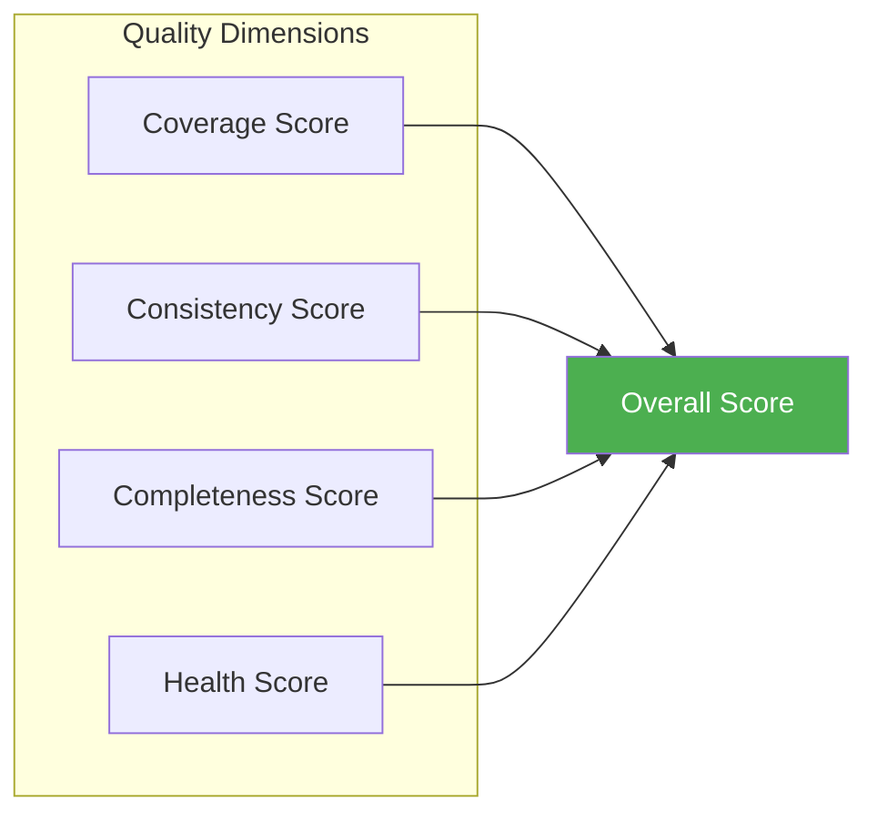
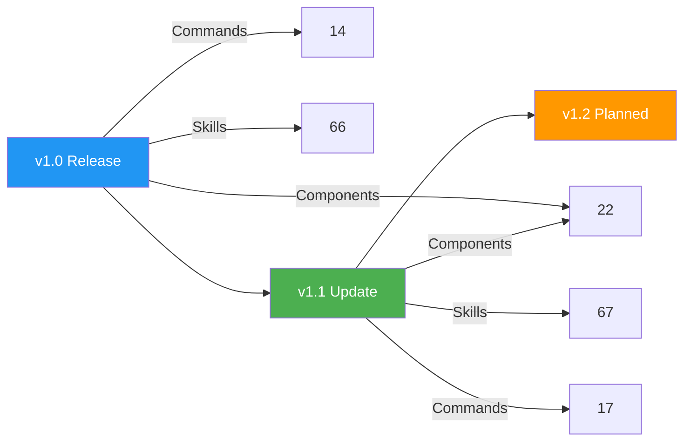
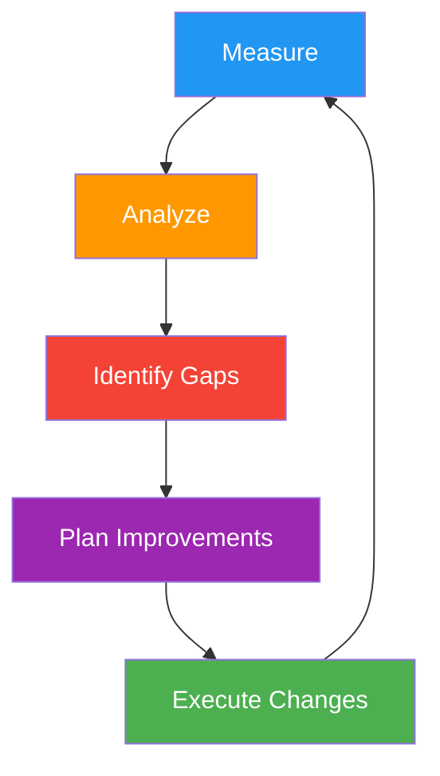

# Metrics System

The metrics system tracks **workspace health** through quantitative measurements. It monitors component counts, coverage, quality scores, and improvement trends.

## Overview

| Metric | Count |
|--------|-------|
| Tracking files | 5 |
| Categories | 4 |
| Update frequency | On workspace changes |

## Tracking Files

| File | Purpose |
|------|---------|
| `CURRENT.md` | Live metrics snapshot — latest values |
| `HISTORY.md` | Metrics history log — change over time |
| `REPORT-TEMPLATE.md` | Periodic report template |
| `SCORING.md` | Scoring methodology and weights |
| `README.md` | System documentation |

## Metrics Categories

### Component Counts

| Component | Target | Current |
|-----------|--------|---------|
| Agents | 21 | 21 ✅ |
| Skills | 67 | 67 ✅ |
| Commands | 17 | 17 ✅ |
| Playbooks | 16 | 16 ✅ |
| Generators | 6 | 6 ✅ |
| Knowledge Docs | 35 | 35 ✅ |
| Examples | 36 | 36 ✅ |

### Quality Scores



| Dimension | Weight | Description |
|-----------|--------|-------------|
| **Coverage** | 30% | Percentage of engineering domains covered by skills |
| **Consistency** | 25% | Adherence to naming conventions and file structure |
| **Completeness** | 25% | Percentage of components with full documentation |
| **Health** | 20% | Cross-references valid, no orphaned files |

### Health Indicators

| Indicator | Status | Description |
|-----------|--------|-------------|
| Manifest sync | ✅ | All manifests match actual files |
| Cross-references | ✅ | All agent→skill links valid |
| No orphaned files | ✅ | Every file is referenced |
| Templates valid | ✅ | All templates have required fields |
| Knowledge current | ✅ | No stale documentation |

## Scoring Methodology

### Overall Score Calculation

```
Overall = (Coverage × 0.30) + (Consistency × 0.25) + (Completeness × 0.25) + (Health × 0.20)
```

### Individual Dimension Scores

#### Coverage Score (30%)

Measures how many engineering domains have adequate skill coverage.

| Condition | Score |
|-----------|-------|
| All domains have ≥3 skills | 100% |
| Most domains have ≥2 skills | 80% |
| Some domains have only 1 skill | 60% |
| Major gaps in coverage | 40% |

#### Consistency Score (25%)

Measures adherence to workspace conventions.

| Check | Weight |
|-------|--------|
| Naming conventions followed | 25% |
| File structure consistent | 25% |
| Frontmatter format correct | 25% |
| Cross-references valid | 25% |

#### Completeness Score (25%)

Measures documentation and configuration completeness.

| Check | Weight |
|-------|--------|
| Agents have descriptions | 20% |
| Skills have workflows | 20% |
| Commands have examples | 20% |
| Knowledge has patterns | 20% |
| Examples have comments | 20% |

#### Health Score (20%)

Measures structural integrity of the workspace.

| Check | Weight |
|-------|--------|
| Manifests are valid | 25% |
| No broken references | 25% |
| No duplicate definitions | 25% |
| All files accessible | 25% |

## Metrics History



| Version | Agents | Skills | Commands | Overall Score |
|---------|--------|--------|----------|---------------|
| v1.0 | 22 | 66 | 14 | 92% |
| v1.1 | 22 | 67 | 17 | 95% |

## Reading Metrics

### Current Snapshot

The `CURRENT.md` file shows the latest metrics:

```markdown
# Current Metrics

Last Updated: 2026-07-19

## Component Counts
| Component | Count |
|-----------|-------|
| Agents | 22 |
| Skills | 67 |
| Commands | 17 |

## Quality Scores
| Dimension | Score |
|-----------|-------|
| Coverage | 94% |
| Consistency | 96% |
| Completeness | 93% |
| Health | 98% |
| **Overall** | **95%** |
```

### History Log

The `HISTORY.md` file tracks changes over time:

```markdown
# Metrics History

## 2026-07-19 — v1.1 Update
- Added workspace-optimization skill (+1 skill)
- Added self-improve command (+1 command)
- Overall score: 92% → 95%

## 2026-07-19 — v1.0 Release
- Initial enterprise workspace
- 22 agents, 66 skills, 14 commands
- Overall score: 92%
```

## Updating Metrics

Metrics are updated through:

1. **Workspace validation** — `/workspace-validate` checks component counts
2. **Self-improvement** — `/self-improve` analyzes and scores dimensions
3. **Manual updates** — edit `CURRENT.md` and `HISTORY.md` directly
4. **Automated checks** — scheduled validation keeps metrics current

## Metrics-Driven Improvement



The metrics system drives improvement through:

1. **Measure** — collect current metrics
2. **Analyze** — identify low-scoring dimensions
3. **Identify** — find specific gaps or issues
4. **Plan** — create improvement tasks
5. **Execute** — make changes
6. **Repeat** — measure again to verify improvement
