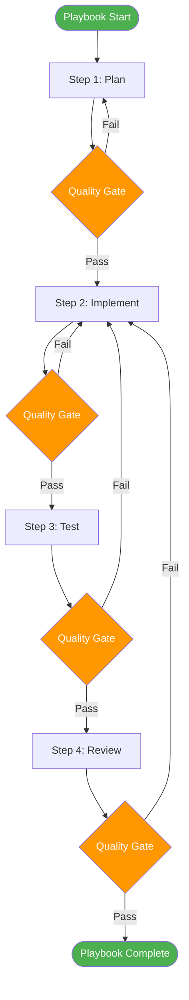
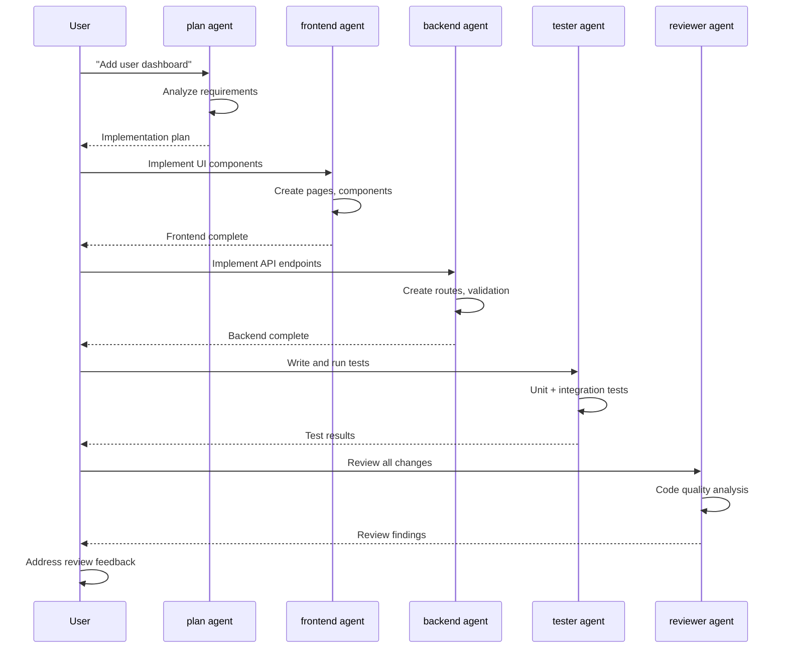

# Playbooks

Playbooks orchestrate **multi-step workflows** that combine agents, skills, and commands into cohesive processes. They define the sequence, dependencies, and quality gates for complex engineering tasks.

## Overview

| Metric | Count |
|--------|-------|
| Total playbooks | 16 |
| Development playbooks | 7 |
| Quality playbooks | 5 |
| Operations playbooks | 4 |

## Development Playbooks (7)

| Playbook | Steps | Agents Involved |
|----------|-------|-----------------|
| **New Feature** | Plan → Design → Implement → Test → Review | plan, frontend, backend, tester, reviewer |
| **Bug Fix** | Diagnose → Fix → Test → Review | build, tester, reviewer |
| **Refactoring** | Analyze → Plan → Execute → Validate | architect, build, tester |
| **New Page** | Plan → Scaffold → Implement → Test → Deploy | frontend, backend, tester, devops |
| **New API** | Design → Implement → Document → Test | api-designer, backend, tester |
| **New Component** | Design → Implement → Test → Document | frontend, designer, tester |
| **Database Migration** | Design → Implement → Test → Deploy | database, backend, tester, devops |

## Quality Playbooks (5)

| Playbook | Steps | Agents Involved |
|----------|-------|-----------------|
| **Code Review** | Scan → Analyze → Report → Recommend | plan, reviewer, security, performance |
| **Security Audit** | Scan → Assess → Report → Remediate | security, build |
| **Performance Audit** | Measure → Analyze → Optimize → Validate | performance, build, tester |
| **Accessibility Audit** | Audit → Report → Fix → Re-test | accessibility, frontend, tester |
| **SEO Audit** | Analyze → Optimize → Validate | seo, frontend |

## Operations Playbooks (4)

| Playbook | Steps | Agents Involved |
|----------|-------|-----------------|
| **Deploy** | Validate → Build → Deploy → Verify | devops, build |
| **Incident Response** | Detect → Diagnose → Fix → Post-mortem | build, devops, security |
| **Workspace Maintenance** | Audit → Optimize → Validate | context-engineer, build |
| **Documentation Update** | Generate → Review → Publish | current agent, reviewer |

## How Playbooks Orchestrate

Playbooks coordinate multiple agents through a defined sequence with quality gates between steps.



### Orchestration Example: New Feature



## Quality Gates

Each playbook step has quality gates that must pass before proceeding.

| Gate Type | Criteria | Tools |
|-----------|----------|-------|
| **Build Gate** | No compilation errors | TypeScript, ESLint |
| **Test Gate** | All tests pass, coverage meets threshold | Jest, Playwright |
| **Review Gate** | No critical findings | reviewer agent |
| **Security Gate** | No high/critical vulnerabilities | security agent |
| **Performance Gate** | No regressions in Core Web Vitals | Lighthouse |

## Playbook Configuration

Playbooks are defined in `playbooks/` directories with structured YAML + Markdown:

```yaml
---
name: new-feature
description: Full workflow for implementing a new feature
steps:
  - name: plan
    agent: plan
    skills: [architecture-patterns]
    gate: none
  - name: implement
    agent: build
    skills: [react-patterns, api-design]
    gate: build
  - name: test
    agent: tester
    skills: [testing-patterns]
    gate: test
  - name: review
    agent: reviewer
    skills: [code-review-standards]
    gate: review
---
```

## Creating Playbooks

Playbooks can be created by:

1. **Manual creation** — write YAML + Markdown in `playbooks/`
2. **Workspace commands** — use `/create-playbook` (coming in v1.2)
3. **Self-improvement** — the workspace can suggest new playbooks based on usage patterns

See [Playbook Templates](/templates/) for starter templates.
