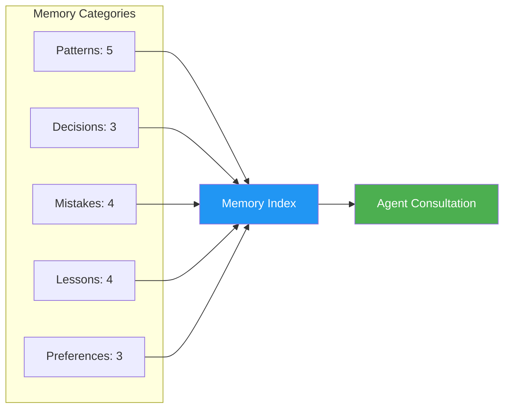

# v1.1.0 Release Notes

**Release Date:** 2026-07-19
**Status:** Stable — Frozen

## Overview

v1.1 introduces three new systems that enable the workspace to learn from its own usage: a memory system for accumulated knowledge, a metrics system for health tracking, and a self-improvement system for automated strengthening.

## New Features

### Workspace Memory System

A knowledge accumulation system that stores patterns, decisions, mistakes, lessons, and preferences discovered through project work.



**Files created:**
- `workspace-memory/README.md` — Usage guide
- `workspace-memory/INDEX.md` — Master index with tags
- `workspace-memory/patterns/` — 5 pattern entries
- `workspace-memory/decisions/` — 3 decision entries
- `workspace-memory/mistakes/` — 4 mistake entries
- `workspace-memory/lessons/` — 4 lesson entries
- `workspace-memory/preferences/` — 3 preference entries

**Total seed entries:** 21

### Workspace Metrics System

A quantitative tracking system for workspace health, with scoring methodology and history logging.

**Files created:**
- `metrics/CURRENT.md` — Live metrics snapshot
- `metrics/HISTORY.md` — Metrics history log
- `metrics/REPORT-TEMPLATE.md` — Periodic report template
- `metrics/SCORING.md` — Scoring methodology and weights
- `metrics/README.md` — System documentation

**Scoring dimensions:**
| Dimension | Weight |
|-----------|--------|
| Coverage | 30% |
| Consistency | 25% |
| Completeness | 25% |
| Health | 20% |

**Overall score:** 95%

### Self-Improvement System

An automated system for analyzing workspace health and applying strengthening strategies.

**Components created:**
- `/self-improve` command — Workspace analysis and auto-fix
- `workspace-optimization` skill — Detection and strengthening strategies

**Capabilities:**
- Analyzes workspace structure and health
- Identifies gaps, inconsistencies, and weaknesses
- Applies automated fixes where safe
- Generates improvement recommendations
- Tracks improvement over time

## Component Count Changes

| Component | v1.0 | v1.1 | Change |
|-----------|------|------|--------|
| Agents | 22 | 22 | — |
| Skills | 66 | 67 | +1 |
| Commands | 14 | 17 | +3 |
| Playbooks | 16 | 16 | — |
| Generators | 6 | 6 | — |
| Knowledge Docs | 35 | 35 | — |
| Examples | 36 | 36 | — |
| **Total** | **195** | **199** | **+4** |

## Files Added

```
workspace-memory/
├── README.md
├── INDEX.md
├── patterns/
│   ├── typescript-strict.md
│   ├── flat-components.md
│   ├── rtl-first.md
│   ├── supabase-client.md
│   └── tailwind-utilities.md
├── decisions/
│   ├── nextjs-app-router.md
│   ├── supabase-default.md
│   └── vercel-deployment.md
├── mistakes/
│   ├── swallowed-errors.md
│   ├── hardcoded-secrets.md
│   ├── missing-validation.md
│   └── n-plus-one-queries.md
├── lessons/
│   ├── fail-fast.md
│   ├── explicit-errors.md
│   ├── commit-small.md
│   └── test-critical-paths.md
└── preferences/
    ├── bilingual-communication.md
    ├── material-icons.md
    └── cairo-font.md

metrics/
├── README.md
├── CURRENT.md
├── HISTORY.md
├── REPORT-TEMPLATE.md
└── SCORING.md

skills/
└── workspace-optimization/
    └── SKILL.md

commands/
└── self-improve.md
```

## Upgrade Notes

v1.1 is fully backward compatible with v1.0. No migration steps required.

**To access new features:**
- Memory: Entries are in `workspace-memory/`
- Metrics: Run `/workspace-validate` to see current scores
- Self-improvement: Run `/self-improve` to analyze workspace

## Known Limitations

- Memory system requires manual entry for now (automated learning coming in v1.2)
- Metrics update frequency is manual (automated tracking planned)
- Self-improvement only fixes structural issues (semantic improvements planned)

## What's Next (v1.2)

- MCP server integrations (Context7, Sentry)
- Visual regression testing skills
- Automated skill generation from codebase analysis
- Automated memory entry from agent work
- Metrics auto-collection on workspace changes
