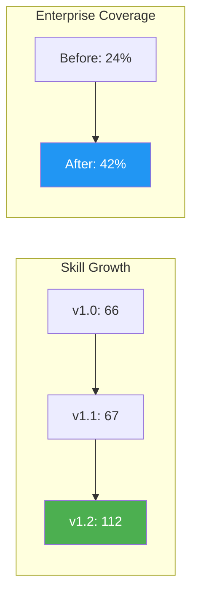

# v1.2.0 Release Notes

**Release Date:** 2026-07-20
**Status:** Stable

## Overview

v1.2 transforms the workspace from a general-purpose AI engineering toolkit into a comprehensive enterprise platform. The skill count grew from 67 to 112 production skills (+67%), with 7 additional optional skills in staging.

## New Features

### Enterprise Skills Expansion (67 → 112)

### 2 New Native Enterprise Skills

| Skill | Purpose |
|-------|---------|
| `ai-context-optimization` | Maximize useful context inside limited context windows — budgeting, prioritization, compression, multi-agent sharing |
| `ai-prompt-compression` | Optimize prompts without reducing reasoning quality — semantic compression, token reduction, cost optimization |

### 15 Enterprise Gap Skills

| Skill | Domain | Purpose |
|-------|--------|---------|
| `ai-guardrails` | AI | Production AI safety — input/output validation, content moderation, prompt injection defense |
| `model-routing` | AI | Model selection — cost/quality/latency trade-offs, fallback chains, A/B testing |
| `llm-evaluation` | AI | LLM evaluation frameworks — benchmarks, metrics, regression testing |
| `ai-cost-optimization` | AI | Token budgeting, caching, model tiering, cost monitoring |
| `domain-driven-design` | Architecture | Bounded contexts, aggregates, domain events, TypeScript patterns |
| `system-design-patterns` | Architecture | Circuit Breaker, Saga, CQRS, Event Sourcing, Outbox, Service Mesh |
| `graphql` | Backend | Schema design, resolvers, N+1, subscriptions, federation |
| `opentelemetry` | Observability | OTel SDK, traces/metrics/logs export, auto-instrumentation |
| `distributed-tracing` | Observability | W3C Trace Context, spans, cross-service tracing, trace-log linking |
| `metrics-engineering` | Observability | RED/USE methods, custom metrics, dashboards, Prometheus + Grafana |
| `audit-logging` | Security | Audit trails, compliance logging (SOC2, GDPR), tamper-proof logging |
| `zero-trust` | Security | Identity verification, micro-segmentation, mTLS, ZTNA |
| `feature-flags` | DevOps | Flag systems, gradual rollouts, kill switches, A/B testing |
| `deployment-strategies` | DevOps | Canary, blue/green, rollback strategies, smoke tests |
| `platform-engineering` | Platform | IDP concepts, developer experience, golden paths |

### 4 New Skill Categories

| Category | Skills Added |
|----------|-------------|
| Platform Engineering | `platform-engineering` |
| Marketing | `copywriting`, `marketing-psychology`, `content-strategy` |
| Utility | `find-skills`, `extract-design-system`, `pdf`, `teach` |
| Process | `prototype`, `to-tickets`, `diagnosing-bugs`, `browser-use` |

---

## Skills Replaced

| Old Skill | New Skill | Reason |
|-----------|-----------|--------|
| `vercel-deployment` | `deploy-to-vercel` | Strictly superior: monorepos, preview envs, rollbacks, edge functions |
| `mcp-integration` | `mcp-builder` | Strictly superior: practical setup, Python + Node/TS, server creation |
| `debug` | `diagnosing-bugs` | Strictly superior: structured diagnosis loop, performance regressions |

## Skills Merged

| Source → Target | What Was Absorbed |
|----------------|-------------------|
| `typography-systems` → `design-systems` | Type scale, font pairing, responsive type |
| `owasp-top-10` → `security-audit` | OWASP Top 10 checklist and mitigations |
| `tdd` → `testing-strategy` | Red→green→refactor workflow |
| `verification-before-completion` → `code-review-standards` | Evidence-before-claims verification |
| `improve-codebase-architecture` → `clean-architecture` | Architecture assessment patterns |
| `frontend-design` → `design-taste-frontend` | UX design fundamentals |

## Skills Enhanced

| Skill | Enhancement |
|-------|-------------|
| `context-engineering` | Hierarchical context, caching strategies, quality evaluation |
| `prompt-engineering` | Chaining, versioning, eval-driven optimization |
| `monitoring-observability` | Three pillars, SLOs/SLIs, error budgets, runbooks |
| `structured-logging` | Log aggregation, PII redaction, log-based alerting |
| `authorization-patterns` | ABAC, hierarchical RBAC, permission caching |
| `background-jobs` | BullMQ/Redis, dead letter queues, event-driven patterns |

---

## Skills Deleted

| Skill | Reason |
|-------|--------|
| 17 × `lark-*` | Off-scope proprietary Chinese platform |
| `web-design-guidelines` | Single URL fetch — not a skill |
| `remotion-best-practices` | Generic React advice, no unique knowledge |
| `agent-browser` | Hidden skill, `browser-use` is superior |
| `theme-factory` | 6 bullet points — not a skill |
| `grill-me`, `grill-with-docs` | Off-scope interview skills |
| `research`, `handoff` | Too thin (9-16 lines) |
| `orchestration` | Tightly coupled to Orca system |
| `using-superpowers` | Meta-skill, not engineering knowledge |
| `simple` | Too thin (34 lines) |
| `para-memory-files` | Redundant with workspace-memory |
| `media-use` | Tightly coupled to HyperFrames |
| `solid-principles` | Absorbed into `clean-architecture` |
| `screen-reader-patterns` | Absorbed into `wcag-checklist` |
| `gallery-management` | Empty directory |
| `ai-hair-tryon` | Placeholder — never implemented |

---

## Component Count Changes

| Metric | v1.1 | v1.2 | Change |
|--------|------|------|--------|
| Production skills | 67 | 112 | +45 (+67%) |
| Optional skills | 0 | 7 | +7 |
| Skill categories | 16 | 20 | +4 |
| Enterprise domain skills | 27 | 51 | +24 (+89%) |
| Enterprise coverage | 24% | 42% | +18% |
| Global agents | 21 | 21 | 0 |
| Global commands | 17 | 17 | 0 |
| Broken references | 5 | 0 | -5 |
| Orphan skills | 5 | 0 | -5 |

---

## Upgrade Notes

- No breaking changes to existing skills
- `vercel-deployment`, `mcp-integration`, and `debug` are removed — update any references
- `solid-principles` content merged into `clean-architecture`
- New skills load on-demand via `@skill` tool — no configuration needed
- MANIFEST.md, AGENTS.md, DEPENDENCIES.md all updated for v1.2

---

## Known Issues

- 7 optional skills in staging require external CLI tools (`belt`, HyperFrames)
- Some Azure skills reference Azure-specific services not available in all environments
- Marketing skills are new to the workspace — may need refinement based on usage

---

## v1.3 Roadmap

- Multi-agent orchestration patterns
- Production RAG implementation guide
- API security hardening
- Alerting engineering
- Visual regression testing
- Advanced prompt engineering patterns
- Plugin system for custom tools

---

*Released by Ahmed Hassaan — 2026-07-20*
