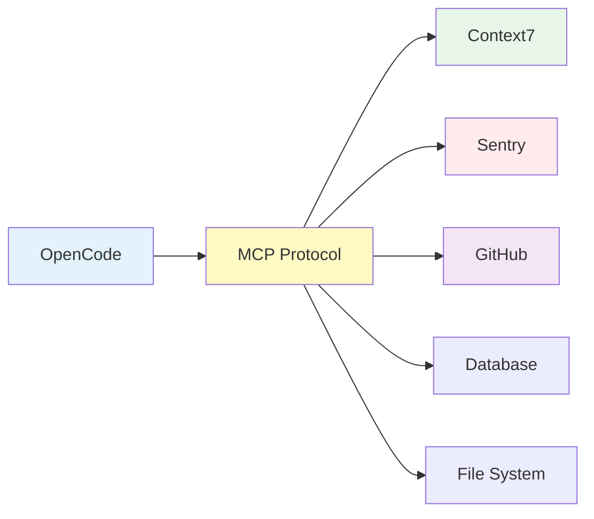
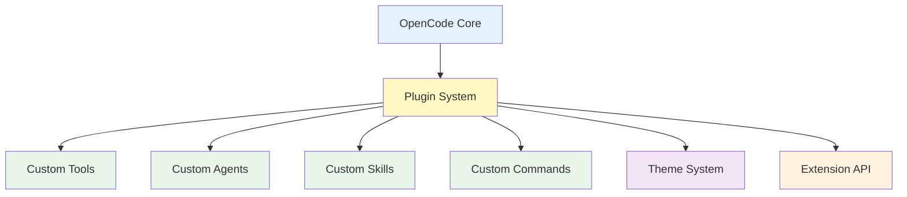
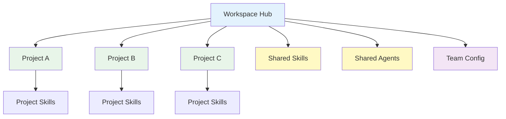

# Roadmap

The Ahmed Enterprise AI Workspace follows a structured evolution path. This page outlines completed milestones and future plans.

## Current Status

### v1.1 Stable (2026-07-19) — Current Release

The workspace is production-ready and stable.

**What's Included:**

| Component | Count | Status |
|-----------|-------|--------|
| Agents | 22 | Stable |
| Skills | 81 | Stable |
| Commands | 22 | Stable |
| Playbooks | 16 | Stable |
| Generators | 6 | Stable |
| Knowledge Docs | 35 | Stable |
| Examples | 36 | Stable |

**Recent Additions:**

- Workspace Memory System (6 categories, 21 seed entries)
- Workspace Metrics System (tracking, history, reporting)
- Self-Improvement System (`/self-improve` command)
- Workspace Optimization Skill

**Stability Level:** Production-ready, recommended for all users.

---

## Upcoming Releases

### v1.2 (Planned)

**Target:** Q3 2026

**Focus:** MCP Server Integrations and Enhanced Tooling

#### MCP Server Integrations



| Feature | Description | Priority |
|---------|-------------|----------|
| **Context7 MCP** | Enhanced context management and retrieval | High |
| **Sentry MCP** | Error tracking and monitoring integration | High |
| **GitHub MCP** | Repository management and PR automation | Medium |
| **Database MCP** | Direct database query capabilities | Medium |
| **File System MCP** | Enhanced file system operations | Low |

#### Visual Regression Testing

| Feature | Description | Priority |
|---------|-------------|----------|
| **Screenshot Comparison** | Automated visual regression testing | High |
| **Pixel Diff** | Detailed pixel-level comparison | Medium |
| **Threshold Configuration** | Customizable comparison thresholds | Medium |
| **Report Generation** | Visual diff reports with annotations | Low |

#### Skill Enhancements

| Feature | Description | Priority |
|---------|-------------|----------|
| **Auto-Generated Skills** | Skills generated from codebase analysis | High |
| **Skill Versioning** | Version tracking for skills | Medium |
| **Skill Dependencies** | Explicit skill dependency management | Medium |
| **Skill Testing** | Automated skill validation | Low |

**Target Metrics:**

- Agents: 22 → 24 (+2)
- Skills: 81 → 90 (+9)
- MCP Servers: 0 → 5 (+5)
- Visual Testing: 0 → 1 (new capability)

---

### v1.3 (Planned)

**Target:** Q4 2026

**Focus:** Advanced AI Capabilities and Plugin System

#### Plugin System



| Feature | Description | Priority |
|---------|-------------|----------|
| **Plugin API** | Public API for extending OpenCode | High |
| **Custom Tools** | User-defined tools for specific tasks | High |
| **Custom Agents** | User-created agents with custom behaviors | High |
| **Custom Skills** | User-created skills with custom knowledge | Medium |
| **Theme System** | Customizable TUI appearance | Medium |
| **Extension Store** | Community extensions marketplace | Low |

#### Advanced Prompt Engineering

| Feature | Description | Priority |
|---------|-------------|----------|
| **Prompt Templates** | Reusable prompt templates | High |
| **Chain-of-Thought** | Built-in chain-of-thought prompting | High |
| **Few-Shot Learning** | Few-shot example management | Medium |
| **Prompt Testing** | Prompt evaluation framework | Medium |
| **Prompt Versioning** | Version control for prompts | Low |

#### LLM Evaluation Framework

| Feature | Description | Priority |
|---------|-------------|----------|
| **Quality Metrics** | Response quality measurement | High |
| **Performance Benchmarks** | Speed and cost analysis | Medium |
| **Comparison Tools** | Side-by-side model comparison | Medium |
| **Evaluation Datasets** | Standardized test datasets | Low |
| **Reporting Dashboard** | Evaluation result visualization | Low |

**Target Metrics:**

- Agents: 24 → 28 (+4)
- Skills: 90 → 100 (+10)
- Plugins: 0 → 10 (community)
- Prompt Templates: 0 → 20 (+20)

---

### v2.0 (Future)

**Target:** 2027

**Focus:** Enterprise Multi-Project Management and Team Collaboration

#### Multi-Project Workspace Management



| Feature | Description | Priority |
|---------|-------------|----------|
| **Project Switching** | Seamless switching between projects | High |
| **Shared Resources** | Shared skills and agents across projects | High |
| **Project Templates** | Pre-configured project templates | High |
| **Cross-Project Search** | Search across multiple projects | Medium |
| **Project Analytics** | Per-project metrics and insights | Medium |

#### Team Collaboration Features

| Feature | Description | Priority |
|---------|-------------|----------|
| **Team Sharing** | Share workspace configurations with team | High |
| **Role-Based Access** | Different access levels for team members | High |
| **Review Workflows** | Team code review integration | Medium |
| **Knowledge Sharing** | Shared knowledge base across team | Medium |
| **Team Metrics** | Team productivity metrics | Low |

#### Cross-Workspace Skill Sharing

| Feature | Description | Priority |
|---------|-------------|----------|
| **Skill Registry** | Central registry for sharing skills | High |
| **Skill Versioning** | Version management for shared skills | Medium |
| **Dependency Resolution** | Automatic dependency management | Medium |
| **Skill Marketplace** | Community skill marketplace | Low |
| **Skill Analytics** | Usage analytics for shared skills | Low |

**Target Metrics:**

- Agents: 28 → 35 (+7)
- Skills: 100 → 120 (+20)
- Team Features: 0 → 10 (+10)
- Marketplace Skills: 0 → 50 (+50)

---

## Version History

### v1.1.0 (2026-07-19)

**Workspace Memory System**
- Created workspace-memory/ with 6 categories
- 21 seed entries covering core engineering knowledge
- README.md with search conventions and usage guide
- INDEX.md with master index and tags

**Workspace Metrics System**
- Created metrics/ with tracking templates
- CURRENT.md — live metrics snapshot
- HISTORY.md — metrics history log
- REPORT-TEMPLATE.md — periodic report template
- SCORING.md — scoring methodology

**Self-Improvement System**
- Created /self-improve command
- Created workspace-optimization skill

**Manifest Updates**
- Skills: 66 → 67
- Commands: 16 → 17

### v1.0.0 (2026-07-19)

**Phase 4.5: Enterprise Workspace Finalization**
- Created 16 engineering playbooks
- Created 6 workspace generators
- Created workspace health system
- Created knowledge base (35 documents)
- Created examples library (36 files)

**Phase 4: Validation & Cleanup**
- Deleted duplicate agent: security-auditor.md
- Deleted duplicate/weak skills
- Renamed code-reviewer.md → reviewer.md
- Merged overlapping skills
- Strengthened weak skills
- Created validate-workspace, state-management skills
- Created MANIFEST.md, DECISIONS.md, DEPENDENCIES.md

**Phase 3: Full Implementation**
- Initial enterprise workspace implementation
- 19 custom agents
- 66 global skills
- 14 reusable commands
- 8-layer workspace architecture
- Smart routing with domain detection
- Knowledge accumulation system

---

## Contributing to the Roadmap

### How to Suggest Features

1. **Open an issue** on the GitHub repository
2. **Use the feature request template**
3. **Describe the use case** and expected behavior
4. **Tag with priority** (high/medium/low)

### Feature Request Template

```markdown
## Feature Request

### Description
[Clear description of the feature]

### Use Case
[Why this feature is needed]

### Expected Behavior
[What should happen]

### Priority
- [ ] High — Critical for workflow
- [ ] Medium — Would improve workflow
- [ ] Low — Nice to have

### Additional Context
[Any other relevant information]
```

### Voting on Features

React to issues with:
- 👍 — I want this feature
- 🎉 — This would be amazing
- ❤️ — I love this idea

Features with more votes get prioritized.

---

## Release Process

### Version Numbering

- **Major (X.0.0)** — Breaking changes, major new features
- **Minor (X.Y.0)** — New features, backward compatible
- **Patch (X.Y.Z)** — Bug fixes, security patches

### Release Checklist

1. Update version in AGENTS.md
2. Update CHANGELOG.md
3. Run full test suite
4. Update documentation
5. Create GitHub release
6. Tag release
7. Announce to community

### Release Cadence

| Release Type | Frequency | Duration |
|--------------|-----------|----------|
| **Major** | Annually | 3-6 months development |
| **Minor** | Quarterly | 1-2 months development |
| **Patch** | As needed | 1-2 weeks development |

---

## Next Steps

- [Installation](/installation) — Get started with the current version
- [Quick Start](/quick-start) — Try the workspace now
- [Architecture](/architecture) — Understand the design decisions
