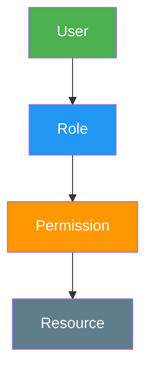
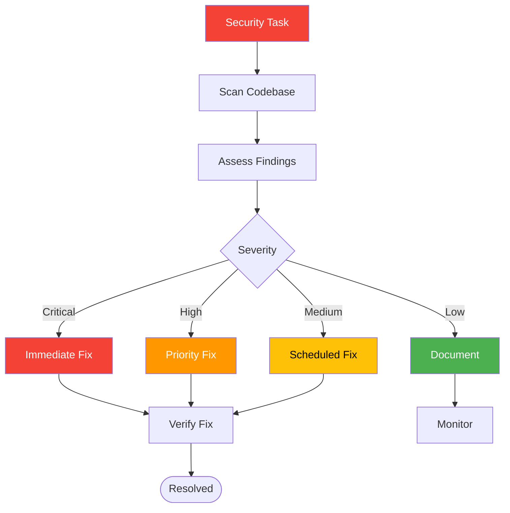

# Security

Security is the **highest-priority domain** in the workspace. Security findings override all other agent decisions. This page documents the security baseline, authentication and authorization patterns, OWASP coverage, and audit checklists.

## Security Baseline

Every project using this workspace must meet these minimum security requirements:

| Requirement | Standard | Enforcement |
|-------------|----------|-------------|
| No hardcoded secrets | Environment variables only | Security agent review |
| Input validation | All external input validated | Security skill checklist |
| Parameterized queries | No string concatenation for SQL | Database skill |
| Secure HTTP headers | CSP, HSTS, X-Frame-Options | Security headers skill |
| Authentication required | All protected routes | Authentication patterns skill |
| Error handling | No stack traces in production | Error handling skill |
| Dependency audit | No known high/critical CVEs | Dependency audit skill |

## Authentication Patterns

### JWT Authentication

```mermaid
sequenceDiagram
    participant Client
    participant Server
    participant Database

    Client->>Server: POST /auth/login (credentials)
    Server->>Server: Validate input
    Server->>Database: Verify credentials
    Database-->>Server: User record
    Server->>Server: Generate JWT (httpOnly cookie)
    Server-->>Client: Set-Cookie: token=jwt; HttpOnly; Secure; SameSite=Strict

    Client->>Server: GET /api/resource (cookie)
    Server->>Server: Verify JWT
    Server->>Database: Fetch data
    Database-->>Server: Data
    Server-->>Client: Response
```

**Best practices:**
- Store JWT in `httpOnly` cookies, never `localStorage`
- Use `Secure` and `SameSite=Strict` flags
- Set short expiration (15 minutes for access tokens)
- Implement refresh token rotation
- Validate JWT on every request

### Session Authentication

**Best practices:**
- Use server-side sessions with secure session IDs
- Regenerate session ID after login
- Set session timeout and idle timeout
- Store sessions in secure, HTTP-only cookies

### OAuth Flows

**Best practices:**
- Use Authorization Code flow with PKCE
- Validate state parameter
- Verify token exchange server-side
- Store tokens securely (httpOnly cookies or server-side)

## Authorization Patterns

### Role-Based Access Control (RBAC)



| Pattern | Use Case | Implementation |
|---------|----------|----------------|
| **RBAC** | Simple role assignments | Role field on user, middleware check |
| **ABAC** | Attribute-based policies | Policy engine, attribute evaluation |
| **RLS** | Database-level access | Supabase RLS policies |

### Supabase RLS Policies

```sql
-- Users can only read their own data
CREATE POLICY "Users read own data" ON documents
  FOR SELECT USING (auth.uid() = user_id);

-- Admins can read all data
CREATE POLICY "Admins read all" ON documents
  FOR SELECT USING (
    EXISTS (
      SELECT 1 FROM user_roles
      WHERE user_id = auth.uid() AND role = 'admin'
    )
  );
```

## OWASP Top 10 Coverage

| OWASP Category | Mitigation | Workspace Skill |
|----------------|------------|-----------------|
| **A01: Broken Access Control** | RLS policies, auth middleware | authentication-patterns |
| **A02: Cryptographic Failures** | TLS, encrypted storage | encryption |
| **A03: Injection** | Parameterized queries, validation | input-validation |
| **A04: Insecure Design** | Threat modeling, secure architecture | security-audit |
| **A05: Security Misconfiguration** | Secure defaults, headers | security-headers, cors-csp |
| **A06: Vulnerable Components** | Dependency auditing | dependency-audit |
| **A07: Auth Failures** | Strong auth, rate limiting | authentication-patterns, rate-limiting |
| **A08: Data Integrity Failures** | Signed responses, integrity checks | input-validation |
| **A09: Logging Failures** | Structured logging, audit trails | logging |
| **A10: SSRF** | Input validation, allowlisting | input-validation |

## Security Audit Checklist

### Pre-Development

- [ ] Environment variables configured (no hardcoded secrets)
- [ ] Dependencies audited for known vulnerabilities
- [ ] Security headers configured
- [ ] CORS policy defined

### Authentication

- [ ] Password requirements enforced (length, complexity)
- [ ] Account lockout after failed attempts
- [ ] Session timeout configured
- [ ] JWT stored in httpOnly cookies
- [ ] Refresh token rotation implemented

### Authorization

- [ ] RLS policies defined for all tables
- [ ] API endpoints have auth checks
- [ ] Role-based access control implemented
- [ ] Privilege escalation tested

### Input Handling

- [ ] All external input validated
- [ ] SQL queries parameterized
- [ ] File uploads validated and restricted
- [ ] URL inputs validated (SSRF prevention)

### Output Handling

- [ ] Error messages don't leak sensitive data
- [ ] Stack traces hidden in production
- [ ] XSS prevention (escaping, CSP)
- [ ] Content-Type headers set correctly

### Infrastructure

- [ ] HTTPS enforced
- [ ] Security headers set (HSTS, CSP, X-Frame-Options)
- [ ] Rate limiting configured
- [ ] DDoS protection in place

### Monitoring

- [ ] Security events logged
- [ ] Failed auth attempts monitored
- [ ] Anomaly detection configured
- [ ] Incident response plan documented

## Security Headers

| Header | Value | Purpose |
|--------|-------|---------|
| `Strict-Transport-Security` | `max-age=31536000; includeSubDomains` | Force HTTPS |
| `Content-Security-Policy` | `default-src 'self'` | Prevent XSS |
| `X-Frame-Options` | `DENY` | Prevent clickjacking |
| `X-Content-Type-Options` | `nosniff` | Prevent MIME sniffing |
| `Referrer-Policy` | `strict-origin-when-cross-origin` | Control referrer |
| `Permissions-Policy` | `camera=(), microphone=()` | Disable unused APIs |

## Security Agent Workflow



## Security Skills Reference

| Skill | Purpose |
|-------|---------|
| security-audit | Comprehensive vulnerability assessment |
| authentication-patterns | Auth flow implementation guidance |
| environment-secrets | Secrets management and rotation |
| input-validation | Sanitization and parameterization |
| cors-csp | CORS and CSP configuration |
| encryption | Data encryption at rest and in transit |
| dependency-audit | Supply chain security |
| security-headers | HTTP security headers |

## Configuration

Security-related configuration:

- **Environment variables:** Never commit `.env` files
- **Security agent:** Always runs on auth-related code
- **Security override:** Security findings override all other decisions
- **Audit frequency:** Run `/security-scan` before every deployment
