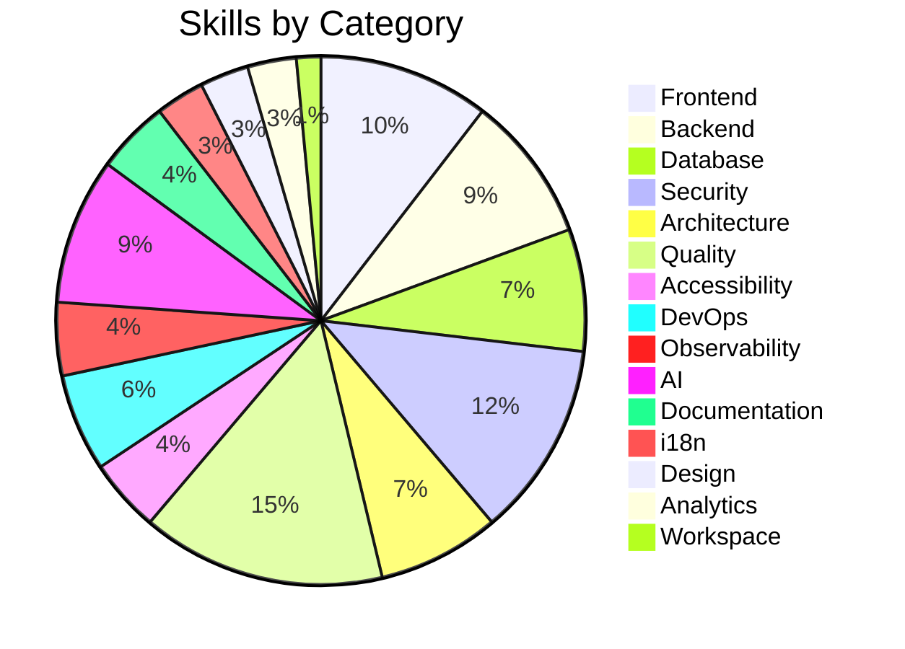
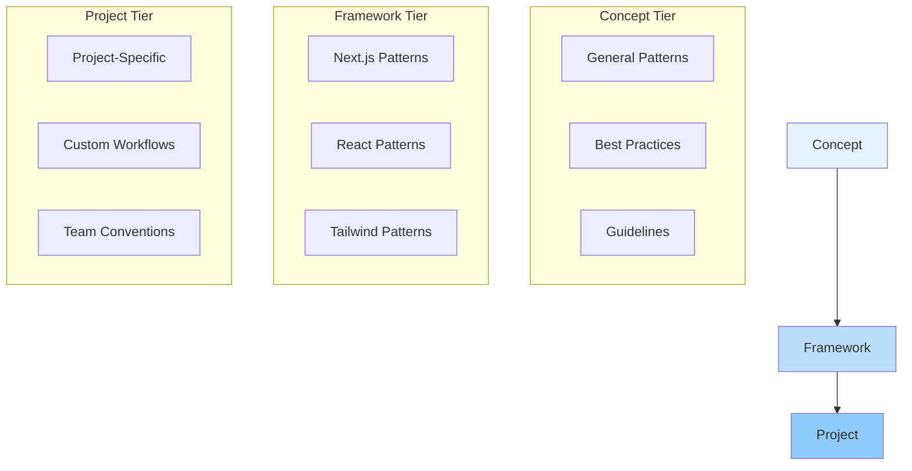
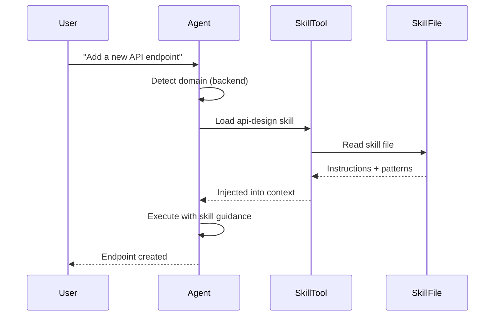

# Skills

Skills are focused instruction files that provide specialized workflows, code patterns, and quality checklists for specific engineering domains. The workspace ships with **67 global skills** organized across **15 categories**.

## Overview

| Metric | Count |
|--------|-------|
| Global skills | 67 |
| Project-specific skills | 14 |
| **Total** | **81** |
| Categories | 15 |



## Skill Categories

### Frontend (7 skills)

| Skill | Description |
|-------|-------------|
| react-patterns | Component patterns, hooks, state management, render optimization |
| nextjs-app-router | App Router conventions, layouts, loading states, server components |
| tailwind-css | Utility-first styling, design tokens, responsive patterns |
| responsive-design | Mobile-first layouts, breakpoints, fluid typography |
| form-engineering | Form validation, controlled components, error handling |
| state-management | React Context, local state patterns, performance considerations |
| css-motion-design | Transitions, animations, keyframes, Framer Motion patterns |

### Backend (6 skills)

| Skill | Description |
|-------|-------------|
| api-design | REST conventions, versioning, error responses, documentation |
| nextjs-route-handlers | Route Handlers, middleware, request/response patterns |
| background-jobs | Queue processing, cron jobs, async task management |
| serverless-patterns | Edge functions, cold start optimization, stateless design |
| webhook-handling | Webhook verification, idempotency, retry logic |
| rate-limiting | Token bucket, sliding window, API throttling |

### Database (5 skills)

| Skill | Description |
|-------|-------------|
| database-design | Schema design, normalization, indexing strategies |
| supabase-patterns | RLS policies, real-time subscriptions, client usage |
| prisma-patterns | Schema definitions, migrations, query optimization |
| query-optimization | N+1 prevention, query plans, connection pooling |
| migration-strategies | Zero-downtime migrations, rollback procedures |

### Security (8 skills)

| Skill | Description |
|-------|-------------|
| security-audit | Vulnerability scanning, threat modeling, OWASP coverage |
| authentication-patterns | JWT, session management, OAuth flows |
| environment-secrets | Environment variable management, secrets rotation |
| input-validation | Sanitization, parameterized queries, XSS prevention |
| cors-csp | CORS configuration, Content Security Policy headers |
| encryption | At-rest and in-transit encryption, key management |
| dependency-audit | Supply chain security, vulnerability scanning |
| security-headers | HTTP security headers, Helmet.js patterns |

### Architecture (5 skills)

| Skill | Description |
|-------|-------------|
| architecture-patterns | Clean architecture, hexagonal, CQRS, event sourcing |
| refactoring-patterns | Code smell detection, safe refactoring steps |
| technical-debt | Debt identification, prioritization, payoff strategies |
| design-patterns | GoF patterns, anti-patterns, composition over inheritance |
| dependency-management | Version pinning, monorepo patterns, lock files |

### Quality (10 skills)

| Skill | Description |
|-------|-------------|
| code-review-standards | Review checklists, common issues, approval criteria |
| testing-patterns | Unit, integration, E2E test patterns and strategies |
| test-strategy | Coverage goals, test pyramid, mutation testing |
| coverage-analysis | Coverage reporting, gap identification, threshold setting |
| error-handling | Error boundaries, try/catch patterns, logging strategies |
| logging | Structured logging, log levels, correlation IDs |
| debugging | Debug workflows, source maps, network inspection |
| type-safety | TypeScript strict mode, generics, type narrowing |
| naming-conventions | Variable, function, file, and folder naming standards |
| code-generation | Scaffolding, template engines, boilerplate reduction |

### Accessibility (3 skills)

| Skill | Description |
|-------|-------------|
| wcag-checklist | WCAG 2.1 AA compliance, automated and manual checks |
| keyboard-navigation | Focus management, tab order, keyboard shortcuts |
| screen-reader-patterns | ARIA labels, live regions, semantic HTML |

### DevOps (4 skills)

| Skill | Description |
|-------|-------------|
| ci-cd-pipelines | GitHub Actions, Vercel pipelines, automated testing |
| vercel-deployment | Vercel configuration, environment variables, preview deploys |
| docker-patterns | Multi-stage builds, optimization, compose configurations |
| monitoring | Health checks, alerting, uptime monitoring |

### Observability (3 skills)

| Skill | Description |
|-------|-------------|
| error-tracking | Sentry integration, error grouping, alerting |
| performance-monitoring | Core Web Vitals, Lighthouse, real user monitoring |
| uptime-monitoring | Status pages, incident response, SLA tracking |

### AI (6 skills)

| Skill | Description |
|-------|-------------|
| llm-integration | OpenAI, Anthropic, model selection, streaming |
| rag-patterns | Document chunking, vector stores, retrieval strategies |
| prompt-engineering | Prompt templates, few-shot, chain-of-thought |
| embedding-strategies | Embedding models, similarity search, indexing |
| ai-evaluation | Output quality measurement, A/B testing, feedback loops |
| vector-databases | Pinecone, pgvector, Qdrant configuration |

### Documentation (3 skills)

| Skill | Description |
|-------|-------------|
| adr-writing | Architecture Decision Records, context and consequences |
| api-documentation | OpenAPI specs, endpoint documentation, examples |
| readme-standards | README structure, badges, installation guides |

### i18n (2 skills)

| Skill | Description |
|-------|-------------|
| i18n-architecture | Translation management, locale routing, key structure |
| rtl-engineering | RTL layouts, bidirectional text, Arabic typography |

### Design (2 skills)

| Skill | Description |
|-------|-------------|
| design-tokens | Color systems, typography scales, spacing tokens |
| css-motion-design | Animation principles, performance budgets, reduced motion |

### Analytics (2 skills)

| Skill | Description |
|-------|-------------|
| event-tracking | Analytics events, user properties, conversion funnels |
| ab-testing | Experiment design, statistical significance, variant management |

### Workspace (1 skill)

| Skill | Description |
|-------|-------------|
| workspace-optimization | Workspace analysis, strengthening strategies, self-improvement |

## Skill Tiers

Skills operate at three distinct tiers, each providing different levels of specificity.



| Tier | Scope | Location | Example |
|------|-------|----------|---------|
| **Concept** | Universal engineering principles | Global skills | error-handling, type-safety |
| **Framework** | Framework-specific patterns | Global skills | nextjs-app-router, react-patterns |
| **Project** | Project-specific conventions | `.opencode/skills/` | Custom form workflows |

## How Skills Are Loaded

Skills are loaded **on-demand** via the `skill` tool. Agents request skills based on task context.



**Loading triggers:**
1. Agent detects domain from file path or keywords
2. Agent checks skill dependencies for the detected domain
3. Skill tool loads the relevant skill file
4. Skill instructions are injected into the agent's context
5. Agent follows skill guidance for execution

## Skill Clusters

Related skills form **clusters** — groups of skills that frequently work together on overlapping concerns.

| Cluster | Skills | Overlap |
|---------|--------|---------|
| **Security** | security-audit ↔ authentication-patterns ↔ environment-secrets | Auth flows depend on secrets management |
| **Database** | database-design ↔ supabase-patterns ↔ prisma-patterns | Schema design affects ORM and client usage |
| **API** | api-design ↔ nextjs-route-handlers | API conventions map to route handler patterns |
| **Performance** | web-performance ↔ caching-strategies ↔ image-optimization ↔ bundle-optimization | All affect Core Web Vitals |
| **Accessibility** | wcag-checklist ↔ keyboard-navigation ↔ screen-reader-patterns | A11y requires all three |
| **Frontend** | react-patterns ↔ nextjs-app-router | React patterns apply within Next.js context |
| **Styling** | tailwind-css ↔ responsive-design | Responsive patterns use Tailwind utilities |

## Skill File Format

Each skill file follows a standard structure:

```markdown
---
name: skill-name
description: What this skill does
category: frontend|backend|database|...
---

# Skill Name

## When to Use
- Condition 1
- Condition 2

## Workflow
1. Step one
2. Step two

## Patterns
### Good Example
\`\`\`typescript
// correct pattern
\`\`\`

### Bad Example
\`\`\`typescript
// incorrect pattern
\`\`\`

## Checklist
- [ ] Check 1
- [ ] Check 2
```

## Configuration

- **Global skills:** `~/.config/opencode/skills/`
- **Project skills:** `.opencode/skills/`
- Skills are auto-discovered from these directories
- Project skills override global skills with the same name
