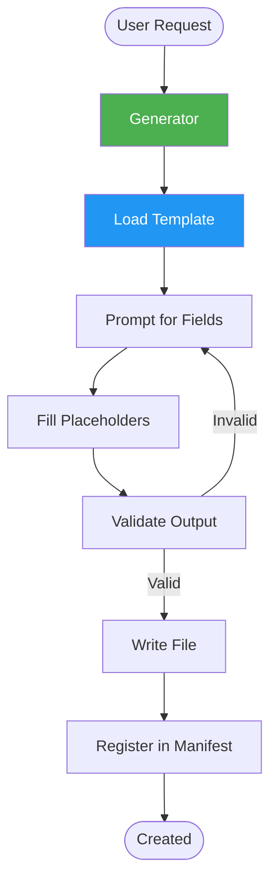
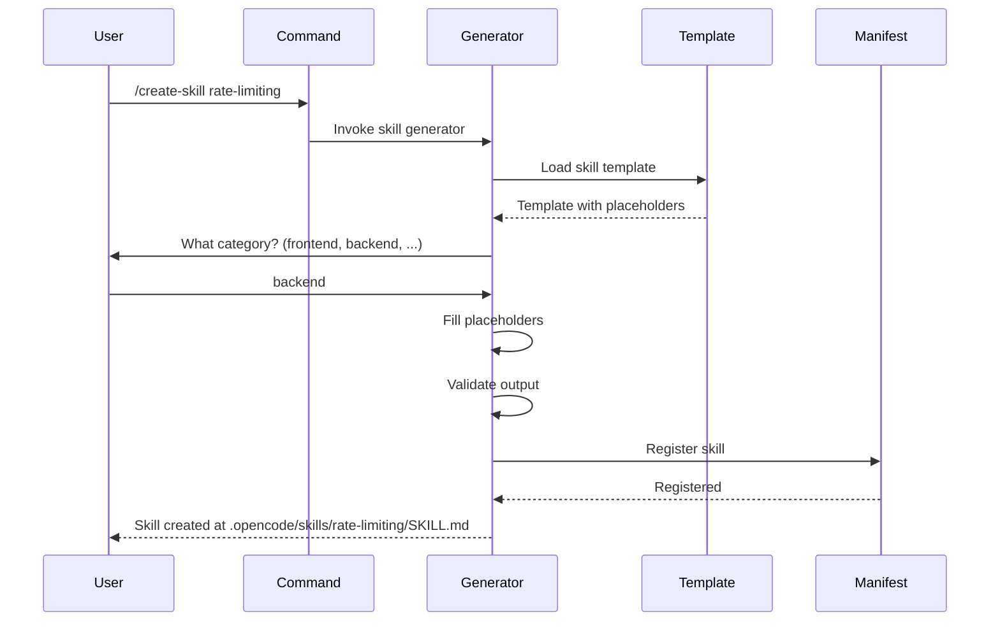

# Templates

Templates provide starting points for creating new workspace components. They include pre-filled structure, placeholder fields, and validation rules to ensure consistency.

## Overview

| Metric | Count |
|--------|-------|
| Total templates | 3 |
| Template types | agent, skill, command |

## Available Templates

### Agent Template

Creates a new agent definition with standard structure.

**Location:** `templates/agent-template.md`

**Fields:**

| Field | Type | Required | Description |
|-------|------|----------|-------------|
| `name` | string | Yes | Agent identifier (lowercase, hyphenated) |
| `description` | string | Yes | What the agent does |
| `tools` | list | Yes | Tool permissions (read, write, bash, search) |
| `read_only` | boolean | No | Whether agent is read-only (default: false) |
| `skills` | list | No | Skill dependencies |

**Template:**

```markdown
---
name: {{name}}
description: {{description}}
tools:
  - read
  - search
  - write
  - bash
read_only: false
skills: []
---

# {{name}}

## Role
{{description}}

## Responsibilities
- Responsibility 1
- Responsibility 2
- Responsibility 3

## Constraints
- Must follow security standards
- Must validate input
- Must handle errors explicitly

## Tool Access
| Tool | Access | Justification |
|------|--------|---------------|
| read | ✅ | Required for analysis |
| write | ✅ | Required for modifications |
| bash | ✅ | Required for build commands |
| search | ✅ | Required for code discovery |
```

**Usage:**

```
/create-agent my-agent-name
```

### Skill Template

Creates a new skill file with standard structure.

**Location:** `templates/skill-template.md`

**Fields:**

| Field | Type | Required | Description |
|-------|------|----------|-------------|
| `name` | string | Yes | Skill identifier (lowercase, hyphenated) |
| `description` | string | Yes | What the skill provides |
| `category` | string | Yes | Category (frontend, backend, etc.) |

**Template:**

```markdown
---
name: {{name}}
description: {{description}}
category: {{category}}
---

# {{name}}

## When to Use
- Condition 1
- Condition 2
- Condition 3

## Workflow
1. Step one
2. Step two
3. Step three

## Patterns

### Good Pattern
```typescript
// Recommended approach
```

### Anti-Pattern
```typescript
// Avoid this approach
```

## Checklist
- [ ] Check 1
- [ ] Check 2
- [ ] Check 3

## References
- [Link to related documentation]
```

**Usage:**

```
/create-skill my-skill-name
```

### Command Template

Creates a new command file with standard structure.

**Location:** `templates/command-template.md`

**Fields:**

| Field | Type | Required | Description |
|-------|------|----------|-------------|
| `name` | string | Yes | Command identifier (lowercase, hyphenated) |
| `description` | string | Yes | What the command does |
| `agent` | string | Yes | Target agent for delegation |

**Template:**

```markdown
---
name: {{name}}
description: {{description}}
agent: {{agent}}
arguments:
  - name: target
    description: Target file or directory
    required: false
---

# {{name}}

{{description}}

## Usage

\`\`\`
/{{name}} [target]
\`\`\`

## What It Does

1. Analyzes the target
2. Performs the operation
3. Reports results

## Agent Delegation

This command delegates to the **{{agent}}** agent.

## Examples

\`\`\`
/{{name}}
/{{name}} src/components/
\`\`\`
```

**Usage:**

```
/create-command my-command-name
```

## How Templates Work



### Step-by-Step Flow



## Template Validation Rules

| Rule | Agent | Skill | Command |
|------|-------|-------|---------|
| Name format | lowercase-hyphenated | lowercase-hyphenated | lowercase-hyphenated |
| No duplicates | ✅ | ✅ | ✅ |
| Required fields | name, description, tools | name, description, category | name, description, agent |
| Agent exists | — | — | ✅ |
| Valid category | — | frontend, backend, ... | — |
| Valid tools | read, write, bash, search | — | — |

## Custom Templates

To create a custom template:

1. Create a file in `templates/`
2. Use `{{field_name}}` for placeholders
3. Add validation rules in `templates/validation.yaml`
4. Reference from generators

Custom templates can be for any workspace component — not limited to agents, skills, and commands.
