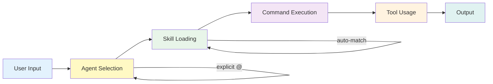

# Workspace Overview

The Ahmed Enterprise AI Workspace is a production-grade AI engineering platform that accelerates software development across any project type.

## What the Workspace Provides

The workspace gives OpenCode a complete set of specialized tools for enterprise software engineering:

- **22 specialized agents** covering every engineering domain
- **81 on-demand skills** with deep domain knowledge
- **22 slash commands** for common workflows
- **16 playbooks** for complex engineering processes
- **6 generators** for creating new workspace components
- **35 knowledge documents** for domain reference
- **36 code examples** across good, bad, and transformation patterns

## Component Counts

| Component | Global | Project | Total | Description |
|-----------|--------|---------|-------|-------------|
| **Agents** | 19 | 3 | 22 | Specialized AI assistants |
| **Skills** | 67 | 14 | 81 | On-demand knowledge modules |
| **Commands** | 17 | 5 | 22 | Slash commands for workflows |
| **Playbooks** | 16 | — | 16 | Step-by-step engineering guides |
| **Generators** | 6 | — | 6 | Automated creation tools |
| **Knowledge Docs** | 35 | — | 35 | Domain reference documents |
| **Examples** | 36 | — | 36 | Code samples and patterns |

## How Components Work Together

### The Execution Flow



1. **User sends a message** — natural language or command
2. **Agent is selected** — either explicitly (`@frontend`) or by domain detection
3. **Skills are loaded** — matching skills inject domain knowledge
4. **Commands are parsed** — slash commands trigger specific workflows
5. **Tools are used** — file operations, search, code generation
6. **Output is delivered** — response with code, suggestions, or actions

### Component Relationships

| Component | Depends On | Used By |
|-----------|------------|---------|
| **Agents** | Skills for domain knowledge | Commands route to agents |
| **Skills** | Cross-reference other skills | Agents load on-demand |
| **Commands** | Agents for execution | Users invoke directly |
| **Playbooks** | Agents + Skills | Guide complex workflows |
| **Generators** | Existing patterns | Create new components |
| **Knowledge** | Domain expertise | Inform agents and skills |
| **Examples** | Code patterns | Illustrate best practices |

## Configuration Reference

### Global Configuration

```bash
~/.config/opencode/
├── AGENTS.md              # Root configuration and manifest
├── agents/                # 19 agent definition files
│   ├── build.md
│   ├── plan.md
│   ├── frontend.md
│   ├── backend.md
│   ├── database.md
│   ├── security.md
│   ├── reviewer.md
│   ├── tester.md
│   ├── performance.md
│   ├── accessibility.md
│   ├── devops.md
│   ├── cloud.md
│   ├── seo.md
│   ├── i18n.md
│   ├── ecommerce.md
│   ├── ai-engineer.md
│   ├── architect.md
│   ├── api-designer.md
│   └── context-engineer.md
├── skills/                # 67 skill directories
│   ├── react-patterns/
│   ├── nextjs-app-router/
│   ├── tailwind-css/
│   ├── ... (64 more)
│   └── workspace-optimization/
├── commands/              # 17 command files
│   ├── review.md
│   ├── security-scan.md
│   ├── performance-check.md
│   ├── ... (13 more)
│   └── self-improve.md
├── knowledge/             # 35 knowledge documents
├── examples/              # 36 code examples
├── playbooks/             # 16 engineering playbooks
├── generators/            # 6 workspace generators
├── workspace-memory/      # Accumulated knowledge
└── metrics/               # Workspace metrics
```

### Project Configuration

```bash
your-project/
├── .opencode/
│   ├── AGENTS.md          # Project-specific instructions
│   ├── agents/            # 3 project-specific agents
│   ├── skills/            # 14 project-specific skills
│   └── commands/          # 5 project-specific commands
```

### Environment Variables

| Variable | Required | Description |
|----------|----------|-------------|
| `OPENCODE_API_KEY` | Yes | OpenCode API authentication |
| `OPENCODE_MODEL` | No | Default model (default: gpt-4) |
| `OPENCODE_CONFIG_DIR` | No | Override config directory |
| `NEXT_PUBLIC_SUPABASE_URL` | No | Supabase project URL |
| `NEXT_PUBLIC_SUPABASE_ANON_KEY` | No | Supabase anonymous key |
| `SUPABASE_SERVICE_ROLE_KEY` | No | Supabase service role key |
| `VERCEL_TOKEN` | No | Vercel deployment token |

## Personal vs Professional Layer

### Personal Layer

Ahmed's established engineering preferences that apply globally:

| Aspect | Preference |
|--------|------------|
| **Primary Language** | TypeScript (strict mode, ES2017 target) |
| **Runtime** | Node.js |
| **Frontend** | Next.js 16 (App Router) |
| **React** | 19+ |
| **Styling** | Tailwind CSS 3.4+ |
| **Backend** | Next.js Route Handlers (REST) |
| **Database** | Supabase (PostgreSQL) |
| **Deployment** | Vercel |
| **Package Manager** | npm |
| **Icons** | Material Symbols Outlined |
| **Colors** | Material Design 3 tokens |
| **Typography** | Cairo (Arabic), Tajawal (display) |
| **Responsive** | Mobile-first with `md:` breakpoints |
| **Dark Mode** | Class-based (`darkMode: "class"`) |

### Professional Layer

Universal engineering standards that apply to all projects:

| Category | Standards |
|----------|-----------|
| **Coding** | Self-documenting code, single responsibility, composition over inheritance, fail fast, meaningful names, <300 lines per file |
| **Architecture** | Separate concerns, clean architecture, dependency inversion, explicit error handling, environment variables, database migrations |
| **Security** | No secrets in source control, input validation, parameterized queries, auth checks, secure headers, dependency auditing |
| **Quality** | No `any` types, handle all error paths, validate env vars, write tests, code review, lint before commit |
| **Documentation** | README.md for every project, ADRs for decisions, API docs, component docs, inline comments for non-obvious logic |

## Version History

### v1.1.0 (2026-07-19) — Current Stable

**New Systems Added:**
- Workspace Memory System (6 categories, 21 seed entries)
- Workspace Metrics System (tracking, history, reporting)
- Self-Improvement System (`/self-improve` command, optimization skill)

**Updated Counts:**
- Skills: 66 → 67
- Commands: 16 → 17

### v1.0.0 (2026-07-19) — Production Release

**Phase 4.5: Enterprise Workspace Finalization**
- 16 engineering playbooks
- 6 workspace generators
- Workspace health system
- 35 knowledge documents
- 36 code examples

**Phase 4: Validation & Cleanup**
- Deleted duplicates and weak skills
- Merged overlapping skills
- Created workspace health system
- Created manifests and synchronization

**Phase 3: Full Implementation**
- 19 custom agents
- 66 global skills
- 14 reusable commands
- 8-layer architecture
- Smart routing with domain detection
- Knowledge accumulation system

## What Makes This Workspace Unique

### Compared to Generic Setups

| Feature | Generic | Ahmed Enterprise |
|---------|---------|-----------------|
| Agents | 1-2 generic | 22 specialized |
| Skills | None | 81 domain-specific |
| Commands | Basic | 22 workflow-optimized |
| Architecture | Ad-hoc | 8-layer structured |
| Knowledge | None | Accumulating memory |
| Quality | Manual | Automated checking |
| Security | Afterthought | Built-in by default |

### Enterprise-Grade Features

- **TypeScript first** — strict mode, no `any`
- **Security by default** — never hardcode secrets
- **RTL-first design** — bilingual Arabic/English
- **Test what matters** — E2E for critical paths
- **Document decisions** — ADRs for architecture
- **Self-improving** — workspace analyzes and optimizes itself

## Next Steps

- [Architecture](/architecture) — Deep dive into the 8-layer model
- [Folder Structure](/folder-structure) — Complete file layout
- [Glossary](/glossary) — All terms defined
